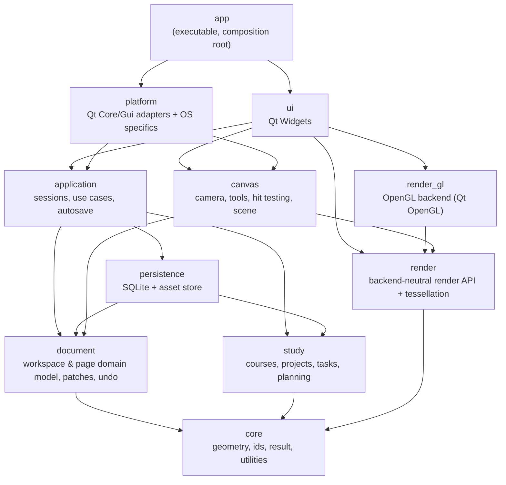

# StudyBoard — Architecture

> Status: **Final baseline.** Phase 1 (foundation & build skeleton) is implemented; everything
> else describes the target design and is built phase by phase (see [ROADMAP.md](ROADMAP.md)).
> This document is the entry point. Details live in the companion documents:
>
> | Document | Covers |
> |---|---|
> | [DATA_MODEL.md](DATA_MODEL.md) | Domain model, ownership, editing, commands, undo/redo |
> | [DATABASE_SCHEMA.md](DATABASE_SCHEMA.md) | SQLite schema, asset storage, migrations, persistence strategy |
> | [CANVAS.md](CANVAS.md) | Coordinate systems, camera, input, tools, hit testing, selection |
> | [RENDERING.md](RENDERING.md) | Renderer abstraction, OpenGL backend, batching, culling, profiling |
> | [TESTING.md](TESTING.md) | Test architecture and test plan |
> | [BUILDING.md](BUILDING.md) | CMake architecture, presets, dependencies, CI, packaging |
> | [ROADMAP.md](ROADMAP.md) | Phased development plan and open questions |

---

## 1. Overview

**StudyBoard** is a **local-first native desktop app** for studying: handwritten and
typed notes on an infinite or paged canvas, PDF annotation, and a planning subsystem
(courses, projects, tasks). It is written in **C++20**, uses **Qt 6.8 LTS Widgets** for the
desktop shell, **OpenGL 3.3 core** (behind a renderer abstraction) for the canvas, and
**SQLite** for persistence.

| Identity | Value |
|---|---|
| Product name | StudyBoard |
| Repository | `studying-app` |
| C++ namespace | `studyapp` (modules: `studyapp::core`, `studyapp::document`, …) |
| CMake targets | `studyapp_<module>` with aliases `studyapp::<module>` |
| Executable | `studyapp` |
| License | MIT (see `LICENSE`); third-party licenses listed in `THIRD_PARTY_NOTICES.md` |
| Supported platforms | Windows 10 22H2+ (x64), macOS 13+, Linux equivalent to Ubuntu 22.04+ |
| Primary dev environment | Windows + Visual Studio 2022 / MSVC |

The architecture is a layered, ports-and-adapters design with one rule above all others:

> **The domain and the engine are plain C++. Qt, OpenGL, SQLite and the operating system
> are details that sit at the edges.**

Concretely, the modules `core`, `document`, `study`, `canvas`, `render` and `application`
compile and run **without Qt**. That buys us:

* fast, headless unit tests (no `QApplication`, no GPU, no display);
* a renderer that could be replaced later (OpenGL is the only backend; QRhi is a *future*
  extension point, not planned work) without touching the model;
* a UI that can be replaced or supplemented (e.g. a future Qt Quick touch UI) without
  touching the model;
* a CI job that builds and tests the entire core on every platform in a couple of minutes.

The trade-off (we re-implement a few conveniences Qt would give us — UUIDs, a tiny
observer utility, a thread-pool interface) is small and deliberate. See the
[decision log](#18-decision-log).

### 1.1 Architectural principles

1. **Dependency direction points inwards.** UI → application → domain. Adapters
   (persistence, rendering backend, platform) depend on the abstractions they implement,
   never the other way round.
2. **Value types for data, objects for behaviour.** Elements, patches, tasks are copyable
   values. Services and sessions are non-copyable objects with explicit owners.
3. **One owner per piece of state.** Every mutable object has exactly one owner, named in
   this document. No global mutable state; no singletons except the write-once log sink.
4. **Interfaces where there are (or will be) multiple implementations** — renderer, text
   layout, PDF rasteriser, executor, clock. Everywhere else, a narrow concrete public API
   is the "interface". We do not add virtual interfaces speculatively.
5. **Composition over inheritance.** Inheritance appears only at genuine polymorphic
   boundaries (the interfaces above, Qt widget subclasses). Element kinds are a
   `std::variant`, not a class hierarchy.
6. **The document is a structured object model**, never a bitmap and never one opaque blob.
   Only dense numeric arrays (stroke points) are stored as binary columns, with a
   versioned, documented codec.
7. **Every edit is a data patch.** The same patch drives undo/redo, persistence, canvas
   cache invalidation and (later) sync. See [DATA_MODEL.md §6](DATA_MODEL.md#6-editing-commands-and-undoredo).
8. **Don't optimise prematurely, but design so optimisation is local.** Known hot paths
   (stroke tessellation, spatial queries, draw submission, page load) sit behind narrow
   seams so they can be optimised after profiling without architectural change.

---

## 2. Dependency graph



External dependencies per module:

| Module | Depends on (external) | Qt? |
|---|---|---|
| `core` | C++20 standard library, `tl::expected` | No |
| `document` | — | No |
| `study` | — | No |
| `render` | — | No |
| `canvas` | — | No |
| `persistence` | SQLite (amalgamation); nlohmann/json from Phase 3 | No |
| `application` | — (links `persistence` **privately**) | No |
| `render_gl` | Qt6::Gui, Qt6::OpenGL | Yes |
| `platform` | Qt6::Core, Qt6::Gui; Qt6::Pdf (optional, Phase 8) | Yes |
| `ui` | Qt6::Widgets; Qt6::OpenGLWidgets (from Phase 4) | Yes |
| `app` | everything | Yes |

Forbidden edges:

* `document`, `study` → Qt, SQLite, OpenGL.
* `render` → `document`, `persistence`, Qt, OpenGL. The renderer draws *render
  primitives*, not domain objects, and never touches the database.
* `canvas` → `persistence`, `application`, Qt. The canvas edits a `PageDocument` through
  an `Editor` and has no idea how or when data is saved.
* `persistence` → `canvas`, `render`, `ui`, Qt.
* `ui` → `persistence` or SQLite. The UI calls `application` services only.
* OpenGL calls anywhere except `render_gl`.

How the boundaries are enforced (implemented in Phase 1):

1. **Link graph.** Each module is its own CMake target that links only its allowed
   dependencies. Third-party libraries are linked `PRIVATE` where possible (SQLite is
   private to `persistence`; `persistence` is private to `application`), so their headers
   are not even on the include path of downstream targets.
2. **Per-module include roots.** Headers live in `src/<module>/include/studyapp/<module>/`,
   so a target can only include headers of modules it links.
3. **Include scanner.** `tools/check_boundaries.py` scans every module for forbidden
   `#include`s (Qt, SQLite, GL headers, forbidden sibling modules). It runs as a CTest test
   and in CI, catching cases the link graph cannot (e.g. system-wide `sqlite3.h`).

---

## 3. Module responsibilities

### `core` — foundation (no domain knowledge)
* Geometry: `Vec2`/`DVec2`, `Rect`/`DRect` *(Phase 1)*; `Affine2`, polyline utilities,
  intersection and distance functions *(added with their first consumer, Phase 2/4)*.
* Strongly typed identifiers: `Uuid` + UUIDv7 generator, `Id<Tag>` → `PageId`,
  `ElementId`, … *(Phase 1)*. All entity id types are declared here so modules can
  *reference* each other's entities without depending on each other (e.g. `study::Task`
  holds `PageId`s).
* `Color` (straight RGBA8, conversions), `Result<T>` = `tl::expected<T, Error>`, `Clock`
  interface, `IdGenerator` interface, logging facade whose sink is installed once by `app`
  *(Phase 1)*.
* `FractionalIndex` (ordering keys) and a tiny `Signal<Args...>` observer utility are
  added in Phase 2, when the document model first needs them.

### `document` — the notes domain
* `WorkspaceCatalog`: notebooks, sections, pages *metadata*, tags. Always fully loaded
  (it is small).
* `PageDocument`: the content of one page — layers and elements. Loaded on demand.
* Element model: `Element` = common header + `std::variant<Stroke, TextBox, Shape, Image, Connector>`.
* `Patch` / `CatalogPatch`: value descriptions of changes; `Editor` applies them and
  records `UndoStack` entries.
* Edit operations ("commands") as free functions producing patches.
* Invariant validation. No I/O, no Qt, no threads.

### `study` — study & planning domain
* `Course`, `Project`, `Task`, `StudySession`, planning value types.
* Pure logic: agenda computation (overdue/today/upcoming), progress roll-ups, recurrence
  expansion (later), sorting/filtering. Operates on values handed to it.
* References notes only by id (`PageId`, `NotebookId`), never by pointer.

### `render` — backend-neutral rendering API
* `Renderer` interface, resource handles (`MeshHandle`, `TextureHandle`), `RenderFrame`
  and `DrawItem` value types, material enum.
* CPU tessellation: variable-width stroke → triangle mesh, shapes → fill/outline meshes,
  arrowheads. Pure functions, heavily unit-tested.
* Knows nothing about pages, elements or the database.

### `render_gl` — OpenGL 3.3 backend
* `OpenGLRenderer : render::Renderer`. The **only** place that includes GL headers or
  calls GL functions. Shaders, VAO/VBO/IBO management, textures, batching, GPU timers.

### `canvas` — interactive canvas engine
* `Camera` (world ↔ view ↔ device transforms), `CanvasScene` (spatial index + per-element
  render cache mirroring a `PageDocument`), hit testing, selection model.
* Input abstraction (`PointerEvent`, `WheelEvent`, `GestureEvent`, `KeyEvent`) and tools
  as explicit state machines (pen, highlighter, eraser, select/lasso, transform, shape,
  text, connector, pan/zoom). The canvas **never** sees Qt event types (see §3.1).
* Builds a `render::RenderFrame` each frame: culled, ordered, with overlays.
* Consumes the `TextLayout` and `DocumentRasterizer` interfaces it defines; `platform`
  implements them with Qt.

### `persistence` — storage adapters
* RAII SQLite wrapper (`Database`, `Statement`, `Transaction`), migrations, pragmas.
* Stores: `CatalogStore`, `PageStore`, `StudyStore`, `SettingsStore`, `SearchIndex`.
* `AssetStore`: content-addressed files on disk for images/PDFs.
* Codecs: stroke point blob codec, rich-text JSON codec.
* `WorkspaceFile`: open/create/lock/backup/export of a workspace directory.
* No UI logic, no Qt, no knowledge of when saves happen.

### `application` — use cases and orchestration
* `WorkspaceSession`: the open workspace — owns catalog, stores, persistence worker, the
  set of open `PageSession`s and the workspace-level undo stack.
* `PageSession`: one open page — owns its `PageDocument`, `Editor`, `UndoStack`; forwards
  committed patches to the persistence queue.
* Services: `SearchService`, `StudyService`, `ImportService` (images/PDF),
  `ExportService` (via `PageExporter` port), `MaintenanceService` (backups, trash purge,
  asset GC).
* Defines the ports it needs from the outside world: `Executor` / `MainThreadDispatcher`,
  `PageExporter`, `ImageDecoder`, `DocumentInspector` (PDF page count/size).
* This is where threading lives (see §10).

### `platform` — Qt and OS adapters
* Implements ports with Qt: `QtExecutor` (QThreadPool), `QtMainThreadDispatcher`,
  `QtTextLayout` (QTextLayout), `QtPdfRasterizer` (QtPdf), `QtImageDecoder`,
  `QtPageExporter` (QPainter → PDF/PNG/SVG), `QtClock`.
* OS-specific functionality behind small interfaces: standard paths, workspace file lock,
  tablet/pen quirks, file-manager reveal, native dark-mode detection fallback.
* Subdirectories `os/windows`, `os/macos`, `os/linux` compiled conditionally.

### `ui` — Qt Widgets presentation
* `MainWindow`, docks, toolbars, notebook tree (`QAbstractItemModel` adapters over the
  catalog), planner views, dialogs, theme manager (`QPalette` + QSS in `resources/themes`).
* `CanvasWidget : QOpenGLWidget` — receives Qt events, passes them through the input
  adapter into `canvas` events, owns the `OpenGLRenderer`, asks the canvas for a frame,
  submits it.
* Holds UI-only state (window layout, selected tool). Never executes SQL, never calls GL
  directly outside `CanvasWidget`'s delegation to `render_gl`.

### `app` — composition root
* `main.cpp` stays small: create `QApplication`, install log sink, read app settings,
  construct adapters, construct `ui::MainWindow` with its dependencies, run the event
  loop. All wiring is explicit constructor injection — no service locator.
* Lives in the top-level `app/` directory (not under `src/`) because it is the only
  target that is not a library.

### 3.1 Input ownership: Qt event → canvas event

The canvas engine must stay plain C++ and headless-testable, so **no Qt event type
(`QMouseEvent`, `QTabletEvent`, `QWheelEvent`, `QKeyEvent`, `QNativeGestureEvent`, …) ever
crosses into `canvas`**. The flow is:

```
Qt event (QMouseEvent / QTabletEvent / QWheelEvent / QKeyEvent / gestures)
    ↓
ui::CanvasWidget                      receives the event on the GUI thread
    ↓
ui::CanvasInputAdapter                normalisation: device kind, pressure/tilt, DPI,
    │                                 coalesced samples, timestamps, modifier mapping;
    │                                 platform tablet quirks via platform/os/* helpers
    ↓
canvas::PointerEvent / WheelEvent / GestureEvent / KeyEvent   (plain C++ values)
    ↓
canvas::CanvasController              temporary tool switches, routing
    ↓
active canvas::Tool                   state machine
    ↓
document::Editor                      commit
    ↓
document::Patch
```

Ownership rules:

* `ui` owns translation. The adapter is the only code that includes both Qt event headers
  and `canvas` input headers.
* `platform/os/*` may provide helpers for device-specific normalisation (Windows Ink vs
  Wintab pressure, macOS tablet proximity, Wayland tablet protocol), called by the adapter.
* `canvas` defines the event value types and consumes them; tests construct them directly.

### 3.2 Implementation status (end of Phase 1)

| Module | Phase 1 content |
|---|---|
| `core` | Implemented foundation: `Vec2`/`DVec2`, `Rect`/`DRect`, `Color`, `Uuid` + `UuidV7Generator`, `Id<Tag>` + entity id aliases, `Error`/`Result`, `Clock`/`SystemClock`, `IdGenerator`, logging facade |
| `document`, `study`, `render`, `canvas`, `render_gl` | **Module anchor only** (`moduleName()`), so the target exists, compiles, links with its final dependencies, and is covered by the boundary checks. `render_gl` already links Qt6::OpenGL but contains no GL calls yet |
| `persistence` | SQLite dependency wiring (vendored amalgamation or system SQLite) and `sqliteVersion()`; no schema, no stores |
| `application` | `componentVersions()` — reports build/library versions for the About dialog, proving the `ui → application → persistence → SQLite` chain without exposing persistence to `ui` |
| `platform` | Qt adapter for the core logging facade (`installQtLogSink()`) |
| `ui` | `MainWindow` (menus, toolbar, placeholder central area, status bar), `ThemeManager` (System/Light/Dark), About dialog |
| `app` | `main.cpp` composition root |

---

## 4. Directory structure

```
studying-app/
├── CMakeLists.txt              # top level: project(), options, add_subdirectory()
├── CMakePresets.json           # shared presets (see BUILDING.md)
├── LICENSE                     # MIT
├── THIRD_PARTY_NOTICES.md      # licenses of fetched/bundled dependencies
├── cmake/                      # StudyAppModule, CompilerWarnings, Sanitizers,
│                               #   Dependencies, Deploy (+ EmbedFiles in Phase 3)
├── app/                        # `studyapp` executable: main.cpp (composition root)
├── src/
│   ├── core/
│   │   ├── CMakeLists.txt
│   │   ├── include/studyapp/core/…   # public headers
│   │   └── src/…                     # private sources and headers
│   ├── document/               # same layout for every module
│   ├── study/
│   ├── render/                 # backend-neutral render API + tessellation
│   ├── render_gl/              # OpenGL 3.3 backend (only place with GL calls)
│   ├── canvas/
│   ├── persistence/
│   │   └── migrations/         # 0001_initial.sql, … (Phase 3; embedded at build time)
│   ├── application/
│   ├── platform/
│   │   ├── qt/                 # (subdirectories appear with their first sources)
│   │   └── os/{windows,macos,linux}/
│   └── ui/
├── resources/
│   ├── themes/                 # light.qss, dark.qss (Phase 1)
│   ├── shaders/                # GLSL 330 core (Phase 4)
│   ├── icons/                  # (Phase 5)
│   └── templates/              # page background templates (Phase 5)
├── tests/
│   ├── core/  document/  study/  render/  canvas/
│   ├── persistence/  application/  ui/
│   ├── architecture/           # module link smoke test
│   ├── fixtures/               # sample workspaces, PDFs, images, golden images (later)
│   └── support/                # shared test helpers (from Phase 2)
├── tools/                      # check_boundaries.py; dev tools later
├── bench/                      # Google Benchmark micro-benchmarks (from Phase 4)
├── docs/
└── .github/workflows/
```

Directories appear when their first real file does; empty placeholder directories are
not committed.

Include style: `#include <studyapp/document/Element.hpp>`; namespace `studyapp::document`.
Public headers are the module's API; anything under `src/` is private. Each module has
its own `include/` root so a target physically cannot include headers of a module it
does not link.

**Deviations from the initially suggested structure, and why:**

* `database/` → **`persistence/`**: the module also owns the on-disk asset store, file
  locking, backups and export bundles, not just SQL.
* `core/` split into **`core/` + `document/`**: foundation utilities must not be tangled
  with domain rules; `study` needs `core` but not the notes model.
* `rendering/` split into **`render/` (API + tessellation, no GL) and `render_gl/`**
  (separate target). This is what makes "the renderer is replaceable" true at link level.
* `platform/` is where **all Qt-backed adapters** for Qt-free ports live, in addition to
  OS-specific code; Qt *is* our primary platform layer.
* Added top-level **`app/`** (tiny composition root), **`tools/`**, **`bench/`** and
  **`tests/support/`**.
* Migrations live **next to the persistence code**, not in `resources/`, because they are
  code, not assets, and must not depend on Qt's resource system.

---

## 5. Domain model (summary)

```
Workspace (a directory on disk)
├── WorkspaceCatalog
│   ├── Notebook ──(optional)── Course
│   │   └── Section (nestable)
│   │       └── Page (metadata: title, extent, background, tags)
│   └── Tag
├── PageDocument (loaded per page)
│   └── Layer
│       └── Element { id, z, transform, locked, payload }
│              payload = Stroke | TextBox | Shape | Image | Connector
├── Study: Course, Project, Task (subtasks), StudySession
└── Assets: content-addressed images / PDFs referenced by id
```

The conceptual `Document → Page → Element` maps to
`WorkspaceCatalog → Page (+ PageDocument) → Element`. A *page* is the unit of canvas
content, loading, undo history and rendering. A PDF import creates one bounded page per
PDF page, each with a `DocumentPage` background. Full details and C++ sketches:
[DATA_MODEL.md](DATA_MODEL.md).

## 6. Database model (summary)

One SQLite database per workspace (`workspace.db`) in WAL mode, relational tables for all
entities, UUIDv7 primary keys stored as 16-byte BLOBs, fractional-index `sort_key`/`z_key`
columns, FTS5 search index maintained by the persistence layer, and large binaries
(images, PDFs) stored as **content-addressed external files** referenced from an `asset`
table. Full DDL: [DATABASE_SCHEMA.md](DATABASE_SCHEMA.md).

## 7. Rendering architecture (summary)

`canvas` produces a `RenderFrame` (camera + ordered, culled draw items referencing
retained meshes/textures) → `render::Renderer` interface → `OpenGLRenderer`.
Tessellation is CPU-side and backend-neutral. The GL backend batches consecutive
compatible items, uses camera-relative ("floating origin") coordinates for precision, and
renders on demand. Full details: [RENDERING.md](RENDERING.md).

## 8. Canvas architecture (summary)

Four coordinate spaces (element-local, world, view, device) with a `Camera` mapping
between them; a `CanvasScene` that mirrors the open `PageDocument` with a spatial hash
grid for culling and hit testing; tools implemented as state machines over an abstract
input model; live previews held in the canvas and committed to the document as one patch
on completion. Full details: [CANVAS.md](CANVAS.md).

## 9. Undo/redo architecture (summary)

Edit operations are **named commands that produce `Patch` values** (before/after
snapshots of only the affected elements). Heavy payloads (stroke points, rich text) are
immutable and shared via `std::shared_ptr<const T>`, so snapshots are cheap and the
document is never copied. The undo stack stores patches; undo applies the inverse patch.
Patches are also what gets persisted. The patch is the single source of truth for an
edit — there are no separate database, canvas or undo commands:

```
Command → Patch ─┬─ Document (apply)
                 ├─ Undo/Redo (stored, inverted)
                 ├─ Persistence (written)
                 ├─ Canvas invalidation (scene/render cache update)
                 └─ future synchronisation (op log)
```

One undo stack per open page plus one
workspace-level stack for structure (notebooks/sections/pages) and study edits. Full
details: [DATA_MODEL.md §6](DATA_MODEL.md#6-editing-commands-and-undoredo).

---

## 10. Threading strategy (staged)

Threading is introduced **incrementally, when a phase actually needs it**. The module
boundaries below are designed so that each step is additive and does not change the domain.

### 10.1 Current state (Phase 1–2): single-threaded

Everything runs on the Qt GUI thread. There is no executor infrastructure, no worker
thread, no connection pool. `core`, `document` and `study` contain no threading
primitives and no locks. The only process-wide state, the log sink, is installed once at
start-up and guarded by a mutex.

### 10.2 Target model (introduced step by step)

The design goal is **no locks in domain code**. Data crosses threads only as immutable
values or by move.

| Thread | Owns / does | Must never | Introduced |
|---|---|---|---|
| **GUI thread** (Qt main) | All `ui`; all domain objects (`WorkspaceCatalog`, `PageDocument`, `Editor`, undo stacks); `canvas`; `OpenGLRenderer` and the GL context; GPU uploads | Block on disk or DB I/O; tessellate whole pages | Phase 1 |
| **Persistence writer** (1 dedicated thread) | The single read-write SQLite connection; applies queued patches in transactions; backups | Touch domain objects (it receives patch *values*) | Phase 3 starts synchronous on the GUI thread; the writer thread is added when measurements show write latency on the GUI thread (expected Phase 4) |
| **Reader connections** (small pool) | Read-only SQLite connections for load/search jobs (WAL permits concurrent readers) | Write | When asynchronous page loading is needed (Phase 4/8) |
| **Worker pool** | Page load decoding, bulk tessellation, image decoding, PDF rasterisation, thumbnails, asset hashing/import, export | Touch GL or widgets | With the first long-running job (Phase 4–8) |

Mechanics once introduced:

* `application` defines `Executor` (post work to the pool) and `MainThreadDispatcher`
  (post a continuation to the GUI thread). `platform` implements them with `QThreadPool`
  and `QMetaObject::invokeMethod(..., Qt::QueuedConnection)`. Tests use a synchronous
  `ImmediateExecutor` so async code is deterministic.
* Persistence work is a FIFO queue of `PersistOp` values (patches, catalog changes, study
  changes). Ordering is preserved; adjacent ops are coalesced into one transaction when the
  queue backs up. Because the queue carries the same `Patch` values the synchronous
  implementation writes, moving persistence off the GUI thread does not change the domain.
* A page load is: reader job → `PageData` value → worker tessellation → dispatch to GUI →
  `PageDocument` constructed and scene populated → GPU uploads within a per-frame budget.
* OpenGL is used on the GUI thread only (QOpenGLWidget renders on the GUI thread). CPU
  work that feeds the GPU (meshes, rasterised text, PDF tiles) is produced off-thread.
* Cancellation: long jobs receive a `std::stop_token`; results for a page that was closed
  meanwhile are dropped on arrival.

## 11. Data storage strategy

* **SQLite is the source of truth for structured data**; the filesystem holds large
  external assets. No custom database, no JSON-file store, no whole-workspace blob.
* **Workspace = a directory**, self-contained and portable (copy it, it works elsewhere).
  Conceptual layout (exact subdirectories may be refined in Phase 3):
  ```
  MyNotes.studyws/
  ├── workspace.db         # SQLite (WAL); -wal/-shm files are transient
  ├── assets/              # content-addressed binaries: assets/ab/cd/<sha256>.<ext>
  ├── backups/             # rotated consistent snapshots (VACUUM INTO)
  ├── temporary/           # in-progress imports/exports; safe to empty when unlocked
  └── .lock                # exclusive-writer lock (see §11.1)
  ```
  Caches (thumbnails, rasterised PDF tiles) live in the OS cache directory keyed by
  workspace id — disposable and never exported.
* **No absolute paths, no machine-specific data** inside the workspace. Per-machine state
  (window geometry, recent workspaces, theme choice) uses `QSettings` in the `ui`/`app`
  layer.
* **Continuous persistence instead of "Save"**: every committed patch is written promptly;
  "Save" merely flushes pending writes. Maximum loss on an application crash ≈ the
  in-flight writes; on power loss, what WAL + `synchronous=NORMAL` permits (the last few
  transactions, never corruption).
* **Export/backup**: "Export workspace" writes a zip (DB snapshot via `VACUUM INTO` +
  referenced assets). "Export notebook" produces the same bundle format filtered to one
  notebook, which can be imported into another workspace.
* **Identity vs. merging.** UUIDv7 ids give every entity a globally unique identity, which
  makes import, remapping and future merge operations *tractable* — it does not make them
  automatically safe. Imports (and any future synchronisation) must still detect
  conflicts (same id already present with different content, dangling references,
  ordering-key collisions) and remap ids where necessary. Bundle import (with conflict
  detection and remapping) is Phase 8; synchronisation is not scheduled.
* Rationale for external assets and details of consistency between files and rows:
  [DATABASE_SCHEMA.md §3](DATABASE_SCHEMA.md#3-asset-storage).

### 11.1 Workspace locking

A workspace supports **one writer at a time**. Locking is implemented in Phase 3
(persistence); the design is fixed now:

```
Open workspace
    ↓
Attempt to acquire lock  ──── SUCCESS ──→ normal read/write operation
    │
    └─ lock held / present
          ↓
       Is the lock active or stale?  (never assumed from the file's existence alone)
          ├── active → ask the user:  Open read-only  |  Cancel
          └── stale  → ask the user:  Recover (take over lock, run integrity check)
                                      | Open read-only | Cancel
```

* **Mechanism**: an OS-level advisory lock held for the whole session on `.lock`
  (`QLockFile` in `platform`, which uses `LockFileEx`/`flock`-style semantics and
  records owner metadata). The OS releases the lock if the process dies, so a crashed
  session does not block the workspace forever.
* **Owner metadata** written into the lock file: process id, host name, application
  name/version, lock creation time and a session UUID. Used to (a) show the user *who*
  holds the lock, and (b) classify staleness.
* **Stale detection**: a lock is stale if the OS-level lock can be acquired (the holder
  is gone), or the recorded host is this machine and the recorded pid no longer exists
  (or belongs to a different process). A lock owned by *another host* (e.g. a workspace on
  a network drive) is never auto-classified as stale; the user must choose recovery
  explicitly.
* **Recovery** takes over the lock, runs `PRAGMA quick_check`, lets SQLite recover the
  WAL, and cleans `temporary/`.
* **Read-only mode** opens SQLite with `SQLITE_OPEN_READONLY`; the UI disables editing.
* **SQLite's own locking** still protects the database file itself; the workspace lock
  exists because the application caches state in memory and owns the asset directory,
  which SQLite knows nothing about.

## 12. Performance considerations

Budgets (targets to validate with benchmarks, not promises):

| Scenario | Target |
|---|---|
| Pan/zoom a page with 10 000 strokes (~2 M points) | 60 fps on integrated GPU |
| Pen-down to ink on screen | ≤ 1 frame beyond OS/input latency |
| Open a page with 10 000 elements | < 300 ms to first frame (progressive after) |
| Commit of an edit (GUI-thread cost) | < 2 ms; disk I/O never on GUI thread |
| Workspace open (catalog of 10 000 pages) | < 500 ms |
| Full-text search over 10 000 pages | < 100 ms |

Where profiling will be needed (instrumented from day one with a scoped timer macro that
compiles to nothing in release, and optionally Tracy later):

1. Stroke tessellation and re-tessellation on zoom (LOD).
2. Spatial index queries (culling + hit testing) at high element counts.
3. Draw call count and buffer uploads per frame (GPU timer queries in `render_gl`).
4. Page load: SQLite read + blob decode + tessellation.
5. Text rasterisation for text boxes at changing zoom levels.
6. PDF tile rasterisation and texture memory.
7. Persistence queue latency under rapid edits (e.g. erasing across 500 strokes).

Known scalable structures chosen up front because they are cheap to do right: floating
origin, spatial hash grid, immutable shared payloads, patch-based persistence (writes only
what changed), on-demand rendering. Deferred until profiling says so: static batch
merging, GPU-side stroke expansion, SQLite R*Tree partial page loading, glyph atlases/MSDF
text.

## 13. Cross-platform considerations

* Supported platforms: **Windows 10 22H2+** x64 (MSVC; primary development environment is
  Windows + Visual Studio 2022), **macOS 13+** (arm64, AppleClang; x86_64 later),
  **Linux** distributions equivalent to **Ubuntu 22.04+** (x86_64, GCC 13+/Clang 17+,
  X11 and Wayland via Qt). On Ubuntu 22.04 the default compiler is GCC 11, so building
  there needs a newer toolchain; binary packages (Phase 9) must bundle a compatible
  `libstdc++`.
* Platform-specific code is allowed only in `src/platform/os/*` (and the `app` target's
  bundle/manifest glue).
* **macOS OpenGL is deprecated and capped at 4.1 core.** We target OpenGL **3.3 core**
  with no extensions required, which works everywhere, and keep the renderer abstraction
  so another backend could be added later. QRhi (Metal/D3D/Vulkan) is recorded as a
  *future* extension point only — it is not scheduled. This is the main platform risk.
* Windows: Qt 6 no longer ships ANGLE; drivers must provide GL 3.3. Deploy
  `opengl32sw.dll` (Mesa llvmpipe) as a software fallback.
* Pen input differs (Windows Ink vs Wintab, macOS tablet events, libinput on Wayland).
  Normalised into `canvas::PointerEvent` in `ui`, with quirks handled in `platform/os/*`.
* HiDPI: all canvas math in logical units; device-pixel ratio applied only at the
  view→device step. Mixed-DPI multi-monitor must be tested.
* Filesystem: paths via `std::filesystem::path` internally, UTF-8 at boundaries; asset
  file names are hex hashes (no case/Unicode normalisation issues).
* Timezones: timestamps stored as UTC; date-only fields stored as floating
  `YYYY-MM-DD`; conversions done in the UI with `QTimeZone` (standard-library tzdb
  support is uneven across libstdc++/libc++/MSVC).
* Line endings/encodings: all text files UTF-8; `.gitattributes` normalises line endings.

## 14. Extension points

| Want to add… | Touch |
|---|---|
| A new element kind (e.g. audio clip, LaTeX) | Add a variant alternative in `document` → compiler lists every `std::visit` to update (bounds, hit test, tessellation, codec, schema table + migration) |
| A new tool | New state machine in `canvas/tools`, register in the tool registry, toolbar entry in `ui` |
| A new rendering backend | Implement `render::Renderer` in a new target; choose it in `app` |
| A new export format | Implement `PageExporter` in `platform` (or elsewhere) |
| A new import source | `ImportService` strategy + possibly a `DocumentRasterizer` implementation |
| Handwriting recognition / OCR | Worker job producing derived text → `SearchIndex`; recogniser behind an interface |
| Sync / collaboration | Patches → durable op log; UUIDs give stable identity and fractional keys reduce ordering conflicts, but conflict detection and id remapping are still required |
| Themes | Files in `resources/themes`; canvas palette mapping in `canvas` render settings |

No plugin system is planned: it would freeze internal APIs too early.

## 15. Risks and trade-offs

| Risk / trade-off | Mitigation |
|---|---|
| OpenGL deprecated on macOS; driver quality on Windows | GL 3.3 core only; renderer abstraction keeps a future backend (e.g. QRhi) possible; software fallback |
| Qt-free core means small re-implementations (UUID, observer, executor interface) | Each is < 200 lines and unit-tested; keeps domain testable and portable |
| Patch snapshots cost memory for huge multi-element edits | Payloads shared immutably; undo memory budget with oldest-entry eviction; can add field-level change kinds later |
| Rich-text editing *on* a zoomable, rotatable canvas is hard | v1: Qt text editor overlay while editing, rasterised texture otherwise; domain stores its own rich-text format, not Qt HTML |
| Translucent strokes (highlighter) darken where they self-overlap | Stencil-based "draw each pixel once" per stroke in the GL backend (RENDERING.md) |
| SQLite database in a cloud-synced folder (Dropbox/OneDrive) can corrupt | Documented as unsupported for the live workspace; workspace lock; backups; export bundles; future proper sync |
| Content-addressed external assets can orphan or go missing | Files-before-rows / rows-before-files ordering, GC with grace period, integrity check tool |
| PDF library licensing (QtPdf/PDFium vs MuPDF (AGPL) vs Poppler (GPL)) | Behind `DocumentRasterizer`; choose after licence review — see ROADMAP open questions |
| Qt version skew on Linux distros | CI installs a pinned Qt; distro packages are best-effort |
| A single SQLite writer thread could become a bottleneck | Coalesced transactions; edits are small; measured in Phase 4 |
| `std::variant` element model makes third-party element types impossible | Intentional: exhaustiveness checking beats open extensibility for this product |

## 16. Future migration possibilities

* **Renderer** (future extension point, not scheduled): QRhi (via `QRhiWidget`,
  Qt ≥ 6.7) to get Metal/D3D12/Vulkan with one backend. The `render` API was designed to map onto QRhi concepts (buffers, textures,
  pipelines, per-frame command recording).
* **C++23**: swap `tl::expected` for `std::expected` (alias already in `core`).
* **UI**: a Qt Quick touch/tablet UI reusing everything below `ui`.
* **Sync**: op log built from patches; possibly CRDT-backed text later.
* **Large pages**: SQLite R*Tree on element bounds for viewport-based partial loading.
* **Mobile**: domain + canvas + render API are portable C++; would need a GLES/QRhi backend.

## 17. Coding conventions (architecture-relevant)

* C++20, no compiler extensions; no C++20 modules yet (Qt/moc/CMake tooling not mature
  enough across our three toolchains).
* Do not format or stream floating-point values or `std::chrono` types with the standard
  library (`std::format`, `std::to_chars`, `operator<<` for chrono) in code built for
  macOS: Apple's libc++ only provides floating-point `to_chars` from macOS 13.3, while the
  deployment target is 13.0. Use Qt formatting in Qt modules, or compare/print raw counts.
* RAII for every resource: SQLite handles, GL objects (owned by the backend), file locks.
* No raw owning pointers; `std::unique_ptr` for ownership, references/`std::span`/views for
  borrowing, `std::shared_ptr<const T>` only for immutable shared payloads.
* Errors: `Result<T>` for expected failures (I/O, DB, parse, validation); assertions for
  programming errors; exceptions do not cross module boundaries.
* Qt types (`QString`, `QImage`, …) never appear in headers of Qt-free modules.
* Warnings as errors in CI; `clang-format` and `clang-tidy` configs added in Phase 1.

## 18. Decision log

| # | Decision | Alternatives considered | Reason |
|---|---|---|---|
| D1 | Domain, canvas, render API, persistence and application are Qt-free | Allow QtCore everywhere | Headless tests, replaceable UI/renderer, clean boundaries; cost is small |
| D2 | SQLite via its C API with a thin RAII wrapper | QtSql | Full control of pragmas, WAL, blob I/O, FTS5; no Qt in persistence; testable with `:memory:` |
| D3 | Vendored SQLite amalgamation (option to use system SQLite) | System SQLite only | Same version and compile options (FTS5, R*Tree) on every platform |
| D4 | One DB per workspace; workspace is a directory | One DB per notebook; single-file package | Cross-notebook search/tags/tasks need one DB; directory allows external assets |
| D5 | Images/PDFs stored as content-addressed external files | BLOBs in SQLite | Large blobs are slower in SQLite, bloat backups/WAL; files dedupe and stream well |
| D6 | UUIDv7 ids (16-byte BLOB) | INTEGER autoincrement | Created before insert (undo/redo re-inserts same id); globally unique identity makes import/remapping/merge tractable (conflict detection still required); time-ordered locality |
| D7 | Fractional-index string keys for ordering | Integer positions | Reorder = one row update; fewer ordering conflicts on import |
| D8 | Element = header + `std::variant` payload | Class hierarchy | Compile-time exhaustiveness, value semantics, no heap per element |
| D9 | Undo via patches (before/after snapshots) with shared immutable payloads | Classic do/undo command objects; QUndoStack | One mechanism for undo, persistence, cache invalidation, sync; QUndoStack is Qt(Gui) |
| D10 | OpenGL 3.3 core via QOpenGLWidget | GL 4.x; QRhi now | Runs on macOS 4.1 cap and old hardware; QRhi remains a future extension point only |
| D11 | CPU tessellation of strokes, cached per element | GPU expansion in shaders | Simple, testable, backend-neutral; optimise after profiling |
| D12 | Continuous persistence (synchronous first, writer thread when measured necessary) | Explicit save; periodic snapshot | Local-first expectation of "never lose work"; small writes |
| D13 | CMake ≥ 3.25, presets v6, FetchContent for small deps, Qt installed externally | vcpkg/Conan for all | Minimal moving parts now; revisit if dependency count grows |
| D14 | Qt 6.8 LTS minimum | Qt 6.5 | LTS, modern colour-scheme APIs (`QStyleHints::colorScheme`) |
| D15 | Product StudyBoard, namespace/executable `studyapp`, MIT license | — | Final product identity; permissive license compatible with dynamically linked LGPLv3 Qt |
| D16 | Threading introduced in stages; Phase 1–2 single-threaded | Full executor/worker/writer infrastructure up front | Determinism and simplicity until a phase measurably needs concurrency; patches as values keep the later move cheap |
| D17 | Qt input is normalised in `ui` into plain `canvas` event values | Canvas consumes Qt events | Canvas stays Qt-free and headless-testable |
| D18 | Workspace lock = OS advisory lock + owner metadata, stale detection, read-only fallback | Existence of `.lock` file as the lock | A leftover file after a crash must not block or mislead; network drives need explicit recovery |
| D19 | Modules without Phase 1 content contain only a *module anchor* (`moduleName()`) | INTERFACE targets; fake feature stubs | Every target compiles and links now, boundaries are enforced from day one, and no speculative feature code exists |

New significant decisions should be appended here (or moved to `docs/adr/` once the list
grows) with context, alternatives and consequences.
