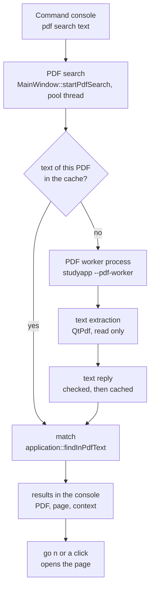

# StudyBoard — Command Console

> **Status: implemented in 1.2** (task 1.2-CMD-01; decisions
> [D54 and D55](ARCHITECTURE.md#18-decision-log)). PDF text extraction is specified in
> [PDF_WORKER.md §23](PDF_WORKER.md#23-text-extraction).

The command console is a small panel in which StudyBoard commands are typed instead of
clicked: open a page by its title, search, import and export, look at the workspace's
state, and search the **text inside imported PDFs**. It is another way to reach operations
StudyBoard already has, plus PDF content search.

It is **not** a terminal, a shell or a scripting language. A line names one registered
StudyBoard command and its arguments; nothing else can run (§8).

---

## 1. Opening and closing

| | |
|---|---|
| Open | **View ▸ Command Console**, or **Ctrl+Shift+C** (⌘⇧C on macOS) |
| Focus | The same shortcut moves the focus to the console's command line when it is open |
| Close | **Esc** in the command line, the same shortcut while the console has the focus, or the panel's close button |

The console is a panel docked at the bottom of the window (it can be moved to the top or
floated). Its visibility is remembered with the window layout. Nothing of it is built
until it is first opened.

## 2. Using it

```
> pdf search "Fourier transform"
Searching the text of 1 PDF for “Fourier transform”… (cancel stops)
PDF search: “Fourier transform”
Notebook › Lecture 05
  [1] Page 4  …the Fourier transform of a periodic signal is a sum of…
  [2] Page 8  …inverse Fourier transform recovers f from F…
2 matches in 1 PDF. Click a result or type go <n> to open its page.
```

| Key (in the command line) | Does |
|---|---|
| Enter | runs the line |
| ↑ / ↓ | previous / next command of this session (§5) |
| Tab | completes a command name (§4) |
| Ctrl+L | clears the output (also `clear`) |
| Esc | closes the console |

Lines that point somewhere — a page, a task — are **links**: click one, or type
`go <n>` with the number shown in brackets, to open it. Numbers belong to the newest list
(each command that lists results starts again at 1). The output is read-only and can be
selected and copied.

Below the command line, a hint shows the commands that match what is typed, or the usage
of the command being typed.

## 3. Syntax

```
command words  argument  "argument with spaces"
```

* Words are separated by spaces or tabs. Command names are not case-sensitive.
* Put an argument in double quotes when it contains spaces:
  `import pdf "C:\Users\me\My Lectures\05.pdf"`. Inside quotes, `\"` is a quote and `\\`
  a backslash; every other backslash is kept as written, so Windows paths need no
  escaping (only a path that *ends* in a backslash needs it doubled: `"C:\dir\\"`).
* A quoted word is always an argument, never a command name.
* A text argument (`<text…>`) takes the rest of the line: `pdf search eigen value` and
  `pdf search "eigen value"` search for the same phrase.
* A line is at most 4 096 bytes. Control characters are refused.

Errors say what is wrong and show the usage, for example
`Missing <text>. Usage: pdf search <text…>` or
`Incomplete command. Did you mean: export page pdf, export page png, …?`.

## 4. Commands

`<x>` is required, `[x]` optional, `…` takes the rest of the line. Aliases in brackets.

| Command | Does | Same as |
|---|---|---|
| `help [command…]` (`?`) | lists the commands, or explains one with examples | — |
| `list notebooks` (`notebooks`) | every notebook with its sections and pages; each line opens its first page | the navigation tree |
| `list sections` (`sections`) | every section by notebook; each opens its first page | the navigation tree |
| `list pages [all]` (`pages`) | the pages of the current section (`all`: of the workspace, by section); PDF pages show their PDF page number | the navigation tree |
| `open page <title…>` (`open`) | opens the page with this title (§4.1) | clicking it in the tree |
| `go <number>` (`open result`) | opens result *number* of the newest list | clicking the link |
| `search <text…>` (`find`) | searches page titles, text boxes and tasks (the best 50) | Edit ▸ Find |
| `pdf search <text…>` (`pdf find`) | searches the text inside the workspace's imported PDFs (§6) | — (new in 1.2) |
| `cancel` | stops a running PDF search | — |
| `workspace info` (`workspace`) | folder, access, contents, imported PDFs, save state, search index | status bar, title |
| `import pdf <path>` | imports a PDF as a new section; one undo step "Import PDF" | File ▸ Import PDF… |
| `export page pdf [path]` | exports the current page as PDF | File ▸ Export Page… |
| `export page png [path]` | … as a PNG image | File ▸ Export Page… |
| `export page svg [path]` | … as SVG | File ▸ Export Page… |
| `export section pdf [path]` | exports every page of the current section as one PDF | File ▸ Export Section as PDF… |
| `undo` / `redo` | undoes / redoes the last change and names it | Edit ▸ Undo / Redo |
| `diagnostics` (`diag`) | versions, platform, workspace and save state, PDF text cache, background work, PDF worker, console limits | Help ▸ About (versions) |
| `history` | the commands entered in this session | ↑ / ↓ |
| `clear` (`cls`) | clears the output | Ctrl+L |

### 4.1 Details

* **`open page`** compares titles without regard to case. An exact title in the current
  section wins over the same title elsewhere; without an exact match, titles that start
  with the text, then titles that contain it. When several pages match, they are listed
  (numbered) instead of opening one.
* **`import pdf`** needs the full path of an existing, readable file. The import itself is
  File ▸ Import PDF's: the file is copied into the workspace, inspected by the PDF worker
  process (D53), and becomes a section in the current notebook. Errors are written in the
  console instead of a dialog. Refused in a read-only workspace.
* **`export …`** without a path opens the same file dialog as the menu command (the format
  is the one named in the command). With a path: it must be absolute, its folder must
  exist, it must lie outside the workspace folder and must not be an existing file (the
  console never overwrites without asking); a missing extension is added
  (`export page png /home/me/page` writes `page.png`); another extension is refused.
* **`undo` / `redo`** run Edit ▸ Undo / Redo, so a console import is undone like a menu
  import and undo of an edit on another page shows that page first.

### 4.2 Autocomplete

Suggestions come from the command registry only: every command name and alias that starts
with the words typed so far, sorted. **Tab** completes a single suggestion (and adds a
space), or the part all suggestions share:

| Typed | Suggestions | Tab gives |
|---|---|---|
| `p` | `pages`, `pdf find`, `pdf search` | `p` (they share nothing more) |
| `pdf s` | `pdf search` | `pdf search ` |
| `exp` | `export page pdf`, `export page png`, `export page svg`, `export section pdf` | `export ` |
| `pdf search x` | — (past the command name: the hint shows the usage) | — |

Arguments (paths, titles) are not completed.

## 5. History

The console keeps the last **100** commands of the session, in memory only: blank lines
are not kept and a command equal to the previous one is kept once. ↑ walks back, ↓
forward; past the newest entry the line you were typing comes back. The history is never
written to the workspace or to settings; `history` lists it.

## 6. PDF content search

`pdf search <text…>` finds words and phrases **in the text of the imported PDFs
themselves** — not in annotations, page titles, file names or StudyBoard's search index.



**What is searched.** Every section that shows pages of an imported PDF. A PDF imported
twice is searched once per section, so each result opens a page of its own section.

**Matching.**
* Case is ignored — for ASCII and also Latin-1, Latin Extended-A, Greek and Cyrillic
  letters (`Übung` finds `übung`).
* Any run of whitespace, including the line breaks a PDF puts inside a sentence, counts as
  one space: `pdf search "Fourier transform"` finds "Fourier" at the end of one line and
  "transform" at the start of the next.
* Punctuation is matched as written (`f(x)`, `(FFT)`, `eigen-`); typographic quotes and
  dashes match their ASCII forms (`don't` finds `don’t`, `1-2` finds `1–2`); the ligatures
  ff fi fl ffi ffl are spelled out; soft hyphens are ignored.
* No wildcards, no regular expressions, no word stemming. A word inside a longer word is
  found (`eigenvalue` also finds `eigenvalues`).

**Results.** Grouped by PDF (shown as "Notebook › Section", the section the import
created), in workspace order; within a PDF by page, then position. Each result shows the
PDF page number and about 40 bytes of text on each side of the match on one line, cut at
word boundaries where possible. At most **50 results per PDF and 200 in all** are shown;
a note says when more were found ("search for a longer phrase").

**Navigation.** Clicking a result, or `go <n>`, opens the StudyBoard page that shows that
PDF page and reveals it in the navigation tree. If that page was deleted, the result is not
listed. The matched words are **not highlighted** on the page: StudyBoard draws PDF pages
as images and has no text layer to highlight (follow-up 1.2-CMD-02).

**Messages.**

| Situation | Console says |
|---|---|
| no PDF in the workspace | No imported PDFs in this workspace (File › Import PDF, or import pdf "<path>"). |
| nothing found | No PDF text matches found for “…”. |
| a PDF without any text (scanned pages) | … has no text layer (a scanned PDF?). |
| the worker crashed or exited | Notebook › Section: PDF search failed: the PDF could not be read (the reader stopped). |
| the worker took longer than 30 s | … PDF search failed: the PDF could not be read in time. |
| not a readable PDF, password-protected | … the file is not a readable PDF document / password-protected PDFs are not supported |
| the stored PDF file is missing | … the PDF file is missing from the workspace (File › Check Workspace lists missing files) |
| `cancel`, a new search, closing the workspace | PDF search for “…” was cancelled. (closing: nothing, the console belongs to the window) |
| empty query | pdf search: give the text to search for, … |

One PDF failing does not stop the others; StudyBoard keeps running in every case.

**One search at a time.** A new `pdf search` stops the running one; `cancel` stops it; the
status bar shows "Searching PDFs…" meanwhile. The rest of StudyBoard stays usable.

## 7. Performance and resources

* **Closed console: no cost.** Nothing is built until the console is first opened; it has
  no timers and no polling, and it does no canvas work.
* **Bounded output.** The output keeps the last **1 000** lines; the numbered targets of
  the newest list at most **500**; listing commands write at most **500** lines.
* **PDF text off the GUI thread.** Extraction runs in the PDF worker process, started from a
  pool thread of the window (the same pool as imports); matching runs on that pool thread
  too. The GUI thread only collects what to search (sections, stored file paths, job ids)
  and writes the results.
* **Each PDF is read once per workspace session.** The extracted text is kept in a cache
  per open workspace, keyed by the stored asset (content-addressed, so it never goes
  stale), at most **32 MiB** and **64 PDFs**, least recently used dropped first; a PDF
  with more text than the whole budget is not kept. The cache is dropped when the
  workspace closes; `diagnostics` shows its size and hits.
* **Bounded text.** The worker sends at most 64 KiB of text per page and 8 MiB per PDF
  (PDF_WORKER.md §23); text beyond that is not searched and the results say so.
* Measured (Release, a 4-vCPU Linux container, not the reference laptop;
  docs/BENCHMARKS.md, `BM_PdfTextInWorker`, `BM_PdfTextSearch`): reading the text of a PDF
  through the worker takes 19 ms for 1 page, 71 ms for 200 pages and 0.48 s for 2 000
  pages (about 600 bytes of text per page) — once per PDF and session; scanning the cached
  text of 2 000 pages for a phrase that is nowhere takes 4.6 ms.

## 8. Safety

* **No operating-system commands.** The console never starts a program, a shell (`sh`,
  `bash`, `cmd.exe`, PowerShell) or `system()`. A line is split into words and matched
  against the registry; anything else is "Unknown command". `$(…)`, backquotes, `|`, `;`,
  `&&`, `>` and `$VAR` have no meaning: inside an argument they are plain text.
* **No scripting.** No variables, loops, pipes, substitutions or command files.
* **The same rules as the menus.** Commands call the window's existing operations and
  application services (`application::search`, `WorkspaceStructure` through the import,
  the session's undo/redo, the page exporter). Edits go Command → Patch → Workspace →
  persistence like every other edit and are undoable; read-only workspaces refuse them.
  The console reads no database and opens no PDF itself.
* **PDFs are parsed only by the PDF worker** (D53): `pdf search` sends the stored file's
  path to `studyapp --pdf-worker` and accepts only a valid text reply of its own job. The
  only process the feature starts is that worker, through the existing client.

## 9. What the console cannot do

* Run programs, shell commands or scripts; open files other than through `import pdf`.
* Edit page content (ink, text, shapes) or rename, move and delete items — use the canvas,
  the tree and the menus.
* Highlight matches on the PDF page; search scanned PDFs (no OCR); search with wildcards or
  regular expressions; search inside images.
* Keep its history between sessions.

## 10. Future batch operations

Batch work will be added as **explicit commands with a typed application API**, never as
scripts. The registry (`application::CommandRegistry`) is the foundation: a command is a
name, typed arguments, help and a handler, so a batch command is one more entry, for
example:

* `export notebook pdf [folder]` — every section of the current notebook, one PDF each;
* `export section png [folder]` — every page of the current section as images.

A console always works on the open workspace; commands across workspaces are not planned.

A batch command must run its file work off the GUI thread (the window's pool), report
progress in the console, honour `cancel`, and make any edit a single undoable command.
Tracked as follow-up 1.2-CMD-03.

## 11. Code

| Part | Where |
|---|---|
| Tokenizer, registry, help, completion, history, `runCommandLine` (Qt-free) | `src/application/{include/studyapp/application,src}/CommandConsole.*` |
| PDF text matching, sources, text cache (Qt-free) | `src/application/{include/studyapp/application,src}/PdfTextSearch.*` |
| Text request and text reply (Qt-free protocol) | `src/ipc/{include/studyapp/ipc,src}/PdfInspection.*` |
| Text extraction in the worker; reply → document text | `src/ui/src/PdfText.*`, `src/ui/src/PdfWorker.cpp` |
| Text jobs in the client | `src/ui/src/PdfInspectionClient.*` (`runPdfTextJob`, `extractPdfTextInWorker`) |
| The panel (output, command line, links, keys) | `src/ui/src/CommandConsole.*` |
| The dock, the commands, PDF search | `src/ui/src/MainWindowConsole.cpp` |

Tests: docs/TESTING.md ("1.2 additions: command console").
