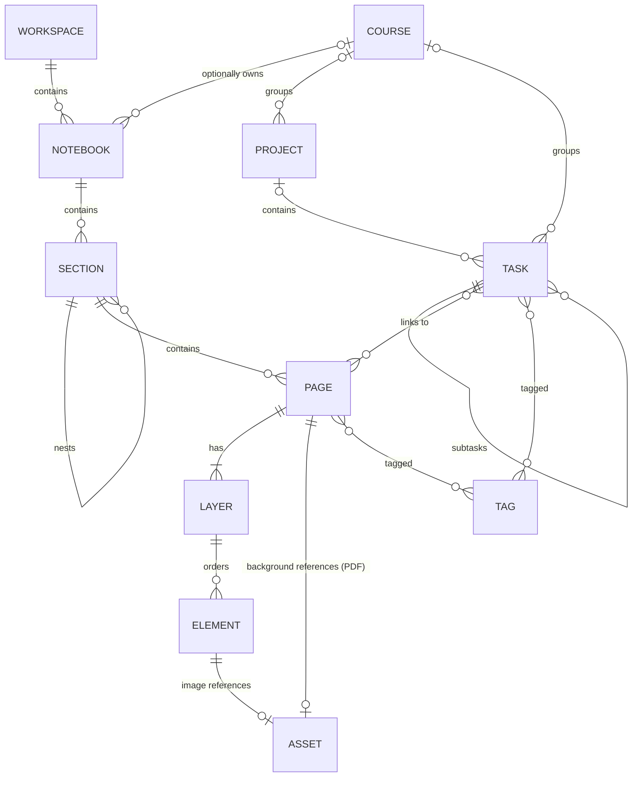
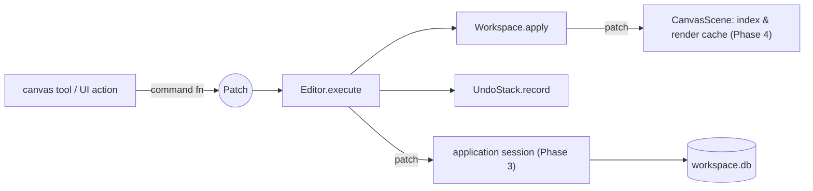

# Data Model

> Status: **Phase 2 implemented; persisted since Phase 3.** §2 (core types), §3 (workspace
> hierarchy), §4.1–4.2 (elements, layers), §4.4 (invariants) and §6 (patches, commands,
> undo/redo) describe the code in `src/core` and `src/document`. Phase 3 stores this model
> in SQLite through the same patches (§6.4; mapping in DATABASE_SCHEMA.md §11). §4.3 (rich
> text), §5 (study model) and the canvas parts of §6.4 and §7 are target design for later
> phases and are marked as such.

This document describes the in-memory domain model (`core`, `document`, `study`), who owns
what, the invariants, and how edits, commands and undo/redo work. The on-disk
representation is in [DATABASE_SCHEMA.md](DATABASE_SCHEMA.md).

---

## 1. Concepts



| Concept | Meaning |
|---|---|
| **Workspace** | Everything the user has in one place: one directory, one database. Users may have several (e.g. per school year) but work in one at a time. |
| **Notebook** | Top-level container of notes, optionally attached to a Course. |
| **Section** | Group of pages inside a notebook; sections can nest (section groups). |
| **Page** | The unit of canvas content. Either **infinite** or **bounded** (paper size). Has a background (plain, pattern, or a page of an imported document). |
| **Layer** | Ordered, per-page grouping of elements with visibility/lock/opacity. Every page has ≥ 1 layer. |
| **Element** | An object on a page: Stroke, TextBox, Shape, Image, Connector. |
| **Asset** | An immutable binary file (image, PDF) stored once per workspace, referenced by id. |
| **Tag** | Workspace-wide label applied to pages and tasks. |
| **Course / Project / Task** | Planning entities in the `study` module. |

"Typed notes" are TextBox elements. A future *document mode* page (fixed width, single
text flow) is a presentation mode over the same element, not a new storage concept.

---

## 2. Foundation types (`core`)

```cpp
namespace studyapp::core {

struct Uuid { std::array<std::byte, 16> bytes; /* ==, <=>, hash, toString, parse */ };

template <class Tag>
struct Id {
    Uuid value;
    friend auto operator<=>(const Id&, const Id&) = default;
};

using NotebookId = Id<struct NotebookTag>;
using SectionId  = Id<struct SectionTag>;
using PageId     = Id<struct PageTag>;
using LayerId    = Id<struct LayerTag>;
using ElementId  = Id<struct ElementTag>;
using AssetId    = Id<struct AssetTag>;
using TagId      = Id<struct TagTag>;
using CourseId   = Id<struct CourseTag>;
using ProjectId  = Id<struct ProjectTag>;
using TaskId     = Id<struct TaskTag>;

class IdGenerator {           // injected; UUIDv7 in production, deterministic in tests
public:
    virtual ~IdGenerator() = default;
    virtual Uuid next() = 0;
};

struct Vec2  { float  x = 0, y = 0; };   // element-local / GPU space
struct DVec2 { double x = 0, y = 0; };   // world space
struct Rect  { Vec2 min, max; };
struct DRect { DVec2 min, max; };

struct Color { std::uint8_t r, g, b, a; };  // straight (non-premultiplied) sRGB

class FractionalIndex;        // ordered string key: first(), between(a, b), before(a), after(b)

using Timestamp = std::chrono::sys_time<std::chrono::milliseconds>; // UTC
struct CalendarDate { std::int32_t year; std::uint8_t month, day; }; // floating date

template <class T> using Result = tl::expected<T, Error>;
}
```

Why ids are in `core`: `study::Task` can hold a `PageId`, and `document` can be tagged by
a `TagId`, without `study` and `document` depending on each other.

---

## 3. Workspace and hierarchy (`document`) — implemented in Phase 2

```
Workspace (WorkspaceInfo: id, name, created)
└── Notebook      NotebookInfo { id, title, order, created, modified }
    └── Section   SectionInfo  { id, notebook, title, order, created, modified }
        └── Page  PageInfo     { id, section, title, order, extent, size, background,
                                 created, modified }
            └── Layer          { id, page, name, order, visible, locked, opacity }
                └── Element    { id, layer, z, transform, locked, payload }
```

**One owner.** `document::Workspace` is the single owner of every record. It stores each
record type in an id-keyed table (`std::unordered_map<Id, Record>`); records point to their
parent **by id**, never by pointer. Ordered child lists (`notebooks()`, `sectionsOf()`,
`pagesOf()`, `layersOf()`, `elementsOf()`) are derived indexes the workspace maintains.

**Identity.** Every record has a typed id (`core::Id<Tag>`: `NotebookId`, `PageId`, ...)
holding a UUIDv7 from the injected `core::IdGenerator`. Identity never depends on memory
addresses, container positions or (later) database row order. Ids are unique per record
type (UUIDv7 makes them globally unique in practice). Globally unique ids make future
import/merge *tractable*; they do not make it conflict-free: conflict detection, id
remapping and a merge policy are still required.

**Ordering.** Siblings are sorted by `core::FractionalIndex` (`order`, or `z` for
elements), ties broken by id, so ordering is total and deterministic. Keys have a
variable-length integer part plus an optional fraction ("fractional indexing"): appends
keep keys at 2–4 characters; inserting between neighbours changes only the new record.

**Controlled mutation.** Queries return `const` pointers/spans (valid until the next
mutation). The only mutation entry point is `Workspace::apply(const Patch&)` (§6). There
are no setters and no mutable access to internal containers.

**Metadata.** `created`/`modified` timestamps (UTC, ms) on notebooks, sections and pages
come from the injected `core::Clock`; renames update `modified`.

Deferred (target design, not implemented yet):

* **Page content loading.** Every page's content lives in the one `Workspace`; Phase 3
  loads the whole workspace when it is opened. The split into an always-loaded catalog and
  per-page `PageDocument`s loaded on demand (with per-page undo scoping) is deferred until
  page-load cost is measured with the canvas (ARCHITECTURE.md decision D25). The storage
  side is already per page (`persistence::PageStore::load(PageId)`).
* **Trash / soft delete** (`trashed` timestamps) — Phase 5 (navigation UI). Phase 2
  deletes are hard deletes, fully restorable by undo.
* **Nested sections, tags, notebook colours/icons, course links** — with the features that
  use them (Phases 5 and 7).

## 4. Page content (`document`)

### 4.1 Element — implemented in Phase 2

`Element` = common header + `std::variant` payload
(`src/document/include/studyapp/document/Element.hpp`):

```cpp
struct Transform { core::DVec2 position; float rotation = 0; core::Vec2 scale{1, 1}; };

struct Element {
    core::ElementId id;
    core::LayerId layer;        // parent
    core::FractionalIndex z;    // painter's order within the layer
    Transform transform;
    bool locked = false;
    ElementPayload payload;     // std::variant<Stroke, TextBox, Shape, Image, Connector>
};
```

| Kind (stable id) | Phase 2 data | Added later |
|---|---|---|
| `Stroke` (1) | brush, colour, base width, points `{x, y, pressure}` in element-local space | smoothing, LOD (Phase 4) |
| `TextBox` (2) | box size, **plain** UTF-8 text | rich-text model (§4.3, Phase 6) |
| `Shape` (3) | kind (rectangle, ellipse, line), size, stroke colour/width, fill | polygons, dashes, corner radius (Phase 6) |
| `Image` (4) | `AssetId` (content-addressed asset store since Phase 3), displayed size | crop (Phase 6) |
| `Connector` (5) | two ends (world position + optional attached element), colour, width | routing, arrow caps, labels (Phase 6) |

Design notes:

* **Closed set, `std::variant`.** Every subsystem must handle every kind; `std::visit`
  makes a missing case a compile error (`kindOf` uses an exhaustive `if constexpr` chain).
  No inheritance hierarchy.
* **Local coordinates + transform.** Stroke points are relative to the element origin, so
  moving/rotating/scaling changes the transform only — cheap to store, undo and persist.
  Positions are `double` (infinite canvas); local data is `float`.
* **Shared immutable points.** `StrokePoints` is
  `std::shared_ptr<const std::vector<StrokePoint>>` — the only shared ownership in the
  model, used so that copying an `Element` (for undo snapshots) never copies point data.
  Points are never mutated in place; an edit creates a new array. `Stroke::operator==`
  compares point *values*.
* **Kind ids are stable** (stored in `element.kind` since Phase 3).
* **Bounds.** `localBounds(payload)` and `worldBounds(element)` (axis-aligned, after scale →
  rotation → translation; connectors use their world end positions) are derived values.
  Phase 3 persists `worldBounds` as the `element.min_x … max_y` cache; the canvas will use
  the same functions for culling (Phase 4).

### 4.2 Layer — implemented in Phase 2

`Layer { id, page, name, order, visible, locked, opacity }`. Layers contain no renderer
state. Every page has at least one layer: `createPage` creates the page together with its
first layer in one patch, and removing a page's last layer is rejected.

### 4.3 Rich text (target design, Phase 6)

The domain owns a small structured rich-text model — **not** Qt HTML and not Markdown —
so it stays Qt-free, versionable and searchable:

```cpp
struct TextStyle { std::string family; float size; bool bold, italic, underline, strike;
                   core::Color color; std::optional<core::Color> highlight; };
struct TextRun   { std::string text; TextStyle style; };           // UTF-8
struct Paragraph { std::vector<TextRun> runs; Alignment align; ListKind list; int indent; };
struct RichText  { std::vector<Paragraph> paragraphs; std::string plainText() const; };
```

Serialised as versioned JSON (`{"v":1,"p":[…]}`); plain text is derived and stored
separately for search. Phase 6 ships plain paragraphs with per-run style; tables, inline
math and embedded objects are future extensions of this model.

### 4.4 Invariants — enforced in Phase 2

`Workspace::apply` rejects any patch that would violate these, and `Workspace::validate()`
re-checks all of them (tests call it after every step):

* Ids are non-null and unique per record type; `before`/`after` of a change carry the
  same id.
* Every record's parent exists (section → notebook, page → section, layer → page,
  element → layer); a record cannot be removed while it still has children.
* Every page has at least one layer (checked at the end of each patch, so a patch may
  remove a page together with all its layers).
* Notebook, section and layer names are not blank (page titles may be empty).
* Numbers are finite and in range: bounded pages have a positive size, background
  spacing > 0, layer opacity in [0, 1], transform scale ≠ 0, stroke width > 0, pressure in
  [0, 1], sizes ≥ 0.
* A stroke has ≥ 1 point; an image references a non-null asset id. Asset *existence* is a
  persistence concern: `application::WorkspaceSession` rejects edits whose images
  reference assets that were never imported, and the database enforces it with a foreign
  key (Phase 3).
* Connector ends attach only to existing, non-connector elements on the same page, never
  to themselves; an element cannot be removed (or moved to another page) while a
  connector is attached to it.
* Sibling order is by (order key, id); derived indexes always match the record tables.

## 5. Study model (`study`) (target design, Phase 7)

```cpp
namespace studyapp::study {

struct Course {
    CourseId id; std::string title, code, term, instructor;
    std::optional<core::Color> color;
    std::optional<core::CalendarDate> start, end;
    std::optional<core::Timestamp> archived;
    core::FractionalIndex order;
};

enum class ProjectStatus { Planned, Active, OnHold, Done, Archived };
struct Project {
    ProjectId id; std::string title, description; ProjectStatus status;
    std::optional<CourseId> course;
    std::optional<core::CalendarDate> start, due;
    core::FractionalIndex order;
};

enum class TaskStatus { Todo, InProgress, Done, Cancelled };
enum class Priority { None, Low, Medium, High };

struct Task {
    TaskId id; std::string title, notes;
    TaskStatus status = TaskStatus::Todo; Priority priority = Priority::None;
    std::optional<CourseId> course; std::optional<ProjectId> project;
    std::optional<TaskId> parent;                             // subtasks
    std::optional<core::CalendarDate> dueDate;                // floating date
    std::optional<std::chrono::minutes> dueTime;              // floating local time of day
    std::optional<TimeBlock> scheduled;                       // UTC start/end (time blocking)
    std::optional<std::chrono::minutes> estimate;
    std::vector<PageId> linkedPages; std::vector<TagId> tags;
    std::optional<core::Timestamp> completed;
    core::FractionalIndex order;
};

// Pure logic, operates on values:
struct Agenda { std::vector<TaskId> overdue, today, upcoming, unscheduled; };
Agenda buildAgenda(std::span<const Task>, core::CalendarDate today);
Progress projectProgress(const Project&, std::span<const Task>);
}
```

**Date semantics.** A due *date* is a calendar date that means "that day wherever I am" —
stored floating, never converted. Scheduled blocks and completion times are instants —
stored as UTC. This avoids the classic "task moved a day when I travelled" bug.

Recurrence (RRULE subset), reminders (need OS notifications — `platform`) and study
sessions/time tracking come after the core planner (see ROADMAP).

---

## 6. Editing, commands and undo/redo — implemented in Phase 2

```
Command (label + Patch) ──► Editor.execute ──► Workspace.apply(patch)   (atomic)
                                 │
                                 └─ on success ──► UndoStack (undo side; redo cleared)
undo:  Workspace.apply(entry.patch.inverted()) ──► entry moves to the redo side
redo:  Workspace.apply(entry.patch)            ──► entry moves back to the undo side
```

### 6.1 Patches — the single description of an edit

The patch is the **single architectural source of truth for an edit**. There are no
separate database, canvas or undo commands; every consumer receives the same patch:

```
Command → Patch ─┬─ Document     (Workspace::apply)                  Phase 2
                 ├─ Undo/Redo    (stored; inverted on undo)          Phase 2
                 ├─ Persistence  (written to SQLite)                 Phase 3
                 ├─ Canvas       (scene / render cache invalidation) Phase 4
                 └─ future sync  (op log)                            later
```

```cpp
template <class Record> struct Change {        // full record state, not a delta
    std::optional<Record> before;               // absent -> create
    std::optional<Record> after;                // absent -> remove
    Change inverted() const;                    // swap before/after
};
using AnyChange = std::variant<Change<NotebookInfo>, Change<SectionInfo>, Change<PageInfo>,
                               Change<Layer>, Change<Element>>;
class Patch {                                   // ordered list of changes
    std::vector<AnyChange> changes_;
public:
    Patch inverted() const;                     // reverse order + invert each change
};
```

Properties:

* **Data only** — no callbacks, no pointers into the document — so patches are
  deterministic, comparable (`operator==`), and can be serialised by persistence in
  Phase 3.
* **Self-validating** — each change's `before` must equal the current record, otherwise
  `apply` fails with `ErrorCode::Conflict`. A stale or mis-ordered patch can never
  silently overwrite newer state.
* **Atomic** — `Workspace::apply` applies changes in order; if any change or the
  end-of-patch invariant check fails, the already-applied changes are reverted (by
  applying their inverses, which cannot fail) and the error names the failing change.
  The workspace is then logically identical to its previous state.
* **One patch type for the whole hierarchy.** *Change from the original design:* the
  baseline had a `CatalogPatch` (notebooks/sections/pages) and a per-page `Patch`
  (layers/elements). With everything in one in-memory `Workspace` (Phase 2), two types
  would only duplicate code, and a command such as "delete notebook" naturally spans both
  levels. Consequence: per-page undo stacks are not introduced yet; when pages are loaded
  on demand (deferred, D25), undo scoping will be decided by which records a patch
  touches, still using this single patch type (ARCHITECTURE.md decision D20).

### 6.2 Commands — named operations that produce patches

Commands are **free functions** in `studyapp::document::commands` — no class hierarchy.
Each reads the workspace (by `const&`), validates its input and returns a
`Command { std::string label; Patch patch; }`; it never mutates anything. Creating
commands return `Created<Id> { Id id; Command command; }`. Ids come from the injected
`IdGenerator`, timestamps from the injected `Clock`, so commands are deterministic.

| Command | Patch |
|---|---|
| `createNotebook` / `renameNotebook` / `deleteNotebook` | create / update / remove the notebook; delete removes the whole subtree deepest-first |
| `createSection` / `renameSection` / `deleteSection` | same, one level down |
| `createPage` / `renamePage` / `deletePage` | create page **and its first layer**; update; remove subtree |
| `createLayer` / `renameLayer` / `deleteLayer` | create / update / remove the layer and its elements (last layer: rejected) |
| `createElement` / `deleteElement` | create (appended in z-order) / remove; connectors attached to removed elements are **detached** in the same patch |

Errors: `NotFound` (unknown id), `InvalidArgument` (blank name, last layer). Anything a
command cannot know in advance is caught by `Workspace::apply`.

### 6.3 Editor and undo stack

* `UndoStack` stores executed `Command`s (label + patch) on an undo side and a redo side,
  with a capacity (default 500 entries; oldest dropped). Recording a new command clears
  the redo side.
* `Editor` (non-owning reference to the `Workspace`) implements `execute`, `undo`, `redo`:
  * failed commands are **not recorded** and change nothing (apply is atomic);
  * commands with an empty patch succeed without being recorded;
  * undo/redo on an empty side return `NotFound` and change nothing;
  * undo restores the exact previous logical state, redo the exact post-command state —
    with the same ids (tested with `Workspace::operator==` after every step).
* History entries share stroke points (`shared_ptr<const>`), so undo does not copy point
  data.

Deferred: merging consecutive edits (typing, nudging) and byte-based history budgets
arrive with the canvas tools that need them (Phase 4/6). Live previews stay out of the
history by design (only the final patch of a gesture is executed).

### 6.4 One patch, many consumers (persistence: Phase 3; canvas: Phase 4)



Undo and redo produce patches too and flow through the same path, so the database,
canvas caches and search index stay consistent without per-command code.

Implemented in Phase 3: `application::WorkspaceSession` owns the `Workspace` and its
`Editor`; after the Editor has applied a command, an undo (the inverse patch) or a redo,
the session writes exactly that patch with `persistence::WorkspaceStore::write` in one
transaction (DATABASE_SCHEMA.md §7.1). Loading a workspace rebuilds the `Workspace` by
applying one creating patch, so persisted data passes the same invariant checks as edits.
Undo history stays in memory; it is not persisted.

---

## 7. Ownership summary

Implemented (Phase 2):

| Object | Owner | Lifetime |
|---|---|---|
| All records (notebooks ... elements) | `document::Workspace` (id-keyed tables) | Until removed by a patch |
| Derived child indexes, connector attachment counts | `document::Workspace` | Updated incrementally on each change |
| Undo/redo entries (`Command`s) | `document::UndoStack`, owned by `document::Editor` | Until evicted by capacity or cleared by a new command |
| The `Workspace` an `Editor` edits | The caller; it must outlive the `Editor` | — |
| Stroke point arrays | Shared, immutable (`shared_ptr<const>`) by records and undo entries | Until the last reference drops |

Implemented (Phase 3):

| Object | Owner | Lifetime |
|---|---|---|
| The open `Workspace`, its `Editor`, the pending-write queue | `application::WorkspaceSession` | Until the session is destroyed |
| The SQLite connection | `persistence::WorkspaceFile`, owned by the session | Until `close()` |
| The workspace lock | the session (a `WorkspaceLock` from the `WorkspaceLocker` port) | Released after the database is closed |
| Asset files | `persistence::AssetStore` (immutable, content-addressed) | Until garbage-collected |

Target (later phases): `canvas::CanvasController` owns the scene, camera, tool and
selection, and `ui::CanvasWidget` owns the OpenGL renderer (Phase 4).

Cross-object references are **by id**, not by pointer, everywhere except short-lived
borrowed references within a function call.

---

## 8. Serialisation formats

| Data | Format | Where |
|---|---|---|
| Stroke points | Binary codec v1: header `{u8 version, u8 channels, u32 count}` + little-endian `f32 x, f32 y, f32 pressure` per point | `stroke.points` BLOB |
| Polygon vertices | Same codec, channels = xy | `shape.vertices` BLOB |
| Rich text | JSON `{"v":1, …}` | `text_box.content` |
| Settings | JSON values keyed by string | `setting.value` |
| Everything else | Relational columns | See DATABASE_SCHEMA.md |

Codec v2 (planned when measured useful): quantised delta + varint encoding, typically
3–4× smaller. The `point_format` column lets both versions coexist; readers support all
versions, writers write the newest. Codecs are fuzzed (see TESTING.md).
