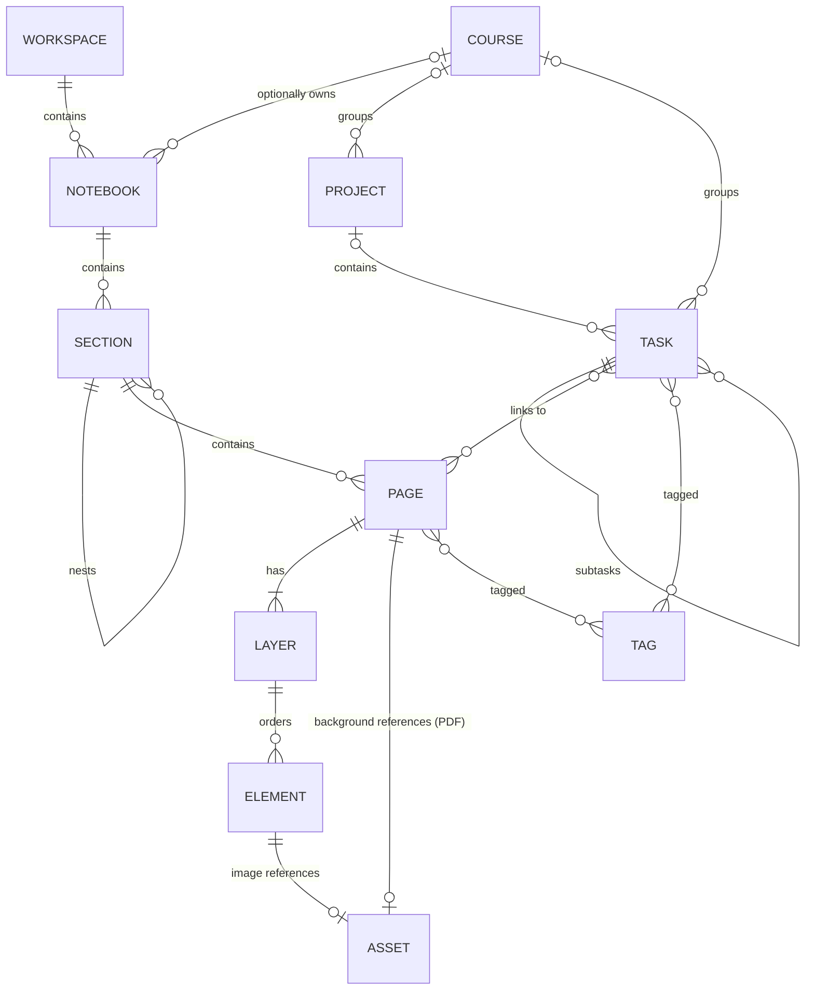
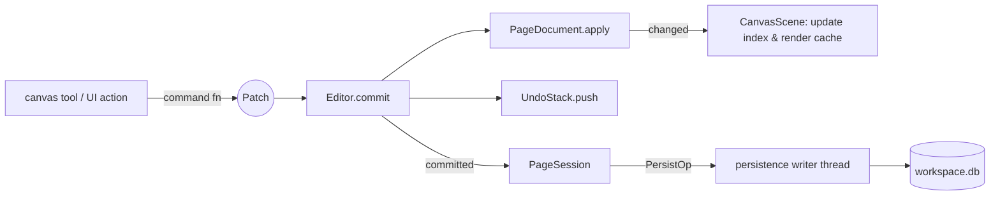

# Data Model

> Status: **Final baseline.** Only the `core` foundation types of §2 exist (Phase 1);
> everything else is implemented from Phase 2 on. Code below is illustrative C++20, not
> final API.

This document describes the in-memory domain model (`core`, `document`, `study`), who owns
what, the invariants, and how edits, commands and undo/redo work. The on-disk
representation is in [DATABASE_SCHEMA.md](DATABASE_SCHEMA.md).

---

## 1. Concepts



| Concept | Meaning |
|---|---|
| **Workspace** | Everything the user has in one place: one directory, one database. Users may have several (e.g. per school year) but work in one at a time. |
| **Notebook** | Top-level container of notes, optionally attached to a Course. |
| **Section** | Group of pages inside a notebook; sections can nest (section groups). |
| **Page** | The unit of canvas content. Either **infinite** or **bounded** (paper size). Has a background (plain, pattern, or a page of an imported document). |
| **Layer** | Ordered, per-page grouping of elements with visibility/lock/opacity. Every page has ≥ 1 layer. |
| **Element** | An object on a page: Stroke, TextBox, Shape, Image, Connector. |
| **Asset** | An immutable binary file (image, PDF) stored once per workspace, referenced by id. |
| **Tag** | Workspace-wide label applied to pages and tasks. |
| **Course / Project / Task** | Planning entities in the `study` module. |

"Typed notes" are TextBox elements. A future *document mode* page (fixed width, single
text flow) is a presentation mode over the same element, not a new storage concept.

---

## 2. Foundation types (`core`)

```cpp
namespace studyapp::core {

struct Uuid { std::array<std::byte, 16> bytes; /* ==, <=>, hash, toString, parse */ };

template <class Tag>
struct Id {
    Uuid value;
    friend auto operator<=>(const Id&, const Id&) = default;
};

using NotebookId = Id<struct NotebookTag>;
using SectionId  = Id<struct SectionTag>;
using PageId     = Id<struct PageTag>;
using LayerId    = Id<struct LayerTag>;
using ElementId  = Id<struct ElementTag>;
using AssetId    = Id<struct AssetTag>;
using TagId      = Id<struct TagTag>;
using CourseId   = Id<struct CourseTag>;
using ProjectId  = Id<struct ProjectTag>;
using TaskId     = Id<struct TaskTag>;

class IdGenerator {           // injected; UUIDv7 in production, deterministic in tests
public:
    virtual ~IdGenerator() = default;
    virtual Uuid next() = 0;
};

struct Vec2  { float  x = 0, y = 0; };   // element-local / GPU space
struct DVec2 { double x = 0, y = 0; };   // world space
struct Rect  { Vec2 min, max; };
struct DRect { DVec2 min, max; };

struct Color { std::uint8_t r, g, b, a; };  // straight (non-premultiplied) sRGB

class FractionalIndex;        // Phase 2: ordered string key: between(a, b), before(a), after(b)

using Timestamp = std::chrono::sys_time<std::chrono::milliseconds>; // UTC
struct CalendarDate { std::int32_t year; std::uint8_t month, day; }; // floating date

template <class T> using Result = tl::expected<T, Error>;
}
```

Why ids are in `core`: `study::Task` can hold a `PageId`, and `document` can be tagged by
a `TagId`, without `study` and `document` depending on each other.

---

## 3. Workspace catalog (`document`)

The catalog holds **metadata only** and is always fully loaded (tens of thousands of rows
at most — a few MB).

```cpp
namespace studyapp::document {

struct NotebookInfo {
    NotebookId id; std::string title; std::optional<core::Color> color;
    std::string icon; std::optional<CourseId> course;
    core::FractionalIndex order;
    core::Timestamp created, updated; std::optional<core::Timestamp> trashed;
};

struct SectionInfo {
    SectionId id; NotebookId notebook; std::optional<SectionId> parent;
    std::string title; std::optional<core::Color> color;
    core::FractionalIndex order; /* timestamps, trashed */
};

enum class PageExtent { Infinite, Bounded };
enum class BackgroundPattern { None, Ruled, Grid, Dots };

struct PageBackground {
    core::Color color{255, 255, 255, 255};
    BackgroundPattern pattern = BackgroundPattern::None;
    float spacing = 32.f;                                  // world units
    std::optional<DocumentPageRef> document;               // {AssetId, pageIndex}
};

struct PageInfo {
    PageId id; SectionId section; std::string title;
    PageExtent extent; core::DVec2 size;                   // size used when Bounded
    PageBackground background;
    std::vector<TagId> tags;
    core::FractionalIndex order;
    std::uint64_t contentVersion;                          // bumps on content change
    /* timestamps, trashed */
};

struct Tag { TagId id; std::string name; std::optional<core::Color> color; };

class WorkspaceCatalog {
public:
    // Queries: notebooks(), sectionsOf(NotebookId), pagesOf(SectionId), page(PageId), tags()…
    void apply(const CatalogPatch&);                // the only mutation entry point
    core::Signal<const CatalogPatch&> changed;
private:
    // flat maps by id + ordered child lists; no pointers between entries
};
}
```

Trash: notebooks, sections and pages are soft-deleted (`trashed` timestamp) so that
deleting a page with 5 000 strokes is a one-field change — trivially undoable and
recoverable from the Trash view. Purging is a maintenance operation.

---

## 4. Page content (`document`)

### 4.1 Element

```cpp
namespace studyapp::document {

struct Transform {                 // no skew, by design
    core::DVec2 position;          // world units; element origin
    float rotation = 0.f;          // radians, about origin
    core::Vec2 scale{1.f, 1.f};
};

// ---- payloads ---------------------------------------------------------------

struct StrokePoint { float x, y; float pressure; };      // element-local coordinates
struct StrokePoints {                                     // immutable once built
    std::vector<StrokePoint> points;
    core::Rect localBounds;                               // precomputed
};

enum class Brush : std::uint8_t { Pen, Pencil, Highlighter, Marker };

struct Stroke {
    Brush brush = Brush::Pen;
    core::Color color;
    float baseWidth = 2.f;                                // world units at pressure 1
    std::shared_ptr<const StrokePoints> points;           // shared, never mutated
};

struct RichText;                                          // see §4.3
enum class TextSizing : std::uint8_t { AutoWidth, FixedWidth, Fixed };

struct TextBox {
    core::Vec2 size;                                      // authoritative box size
    TextSizing sizing = TextSizing::FixedWidth;
    std::shared_ptr<const RichText> content;              // shared, never mutated
    std::optional<core::Color> background;
    float padding = 4.f;
};

enum class ShapeKind : std::uint8_t { Rectangle, Ellipse, Line, Triangle, Polygon, Polyline };

struct ShapeStyle {
    std::optional<core::Color> stroke; float strokeWidth = 2.f;
    DashPattern dash = DashPattern::Solid;
    std::optional<core::Color> fill; float cornerRadius = 0.f;
};

struct Shape {
    ShapeKind kind; core::Vec2 size; ShapeStyle style;
    std::shared_ptr<const std::vector<core::Vec2>> vertices; // Polygon/Polyline only
};

struct Image {
    AssetId asset; core::Vec2 size;                       // displayed size, local units
    core::Rect crop{{0, 0}, {1, 1}};                      // normalised in source image
    float opacity = 1.f;
};

struct ConnectorEnd {
    core::DVec2 position;                                 // world; used when free, cached when attached
    std::optional<ElementId> attachedTo;
    core::Vec2 anchor{0.5f, 0.5f};                        // normalised in target's local bounds
    ArrowCap cap = ArrowCap::None;
};

struct Connector {
    ConnectorEnd start, end;
    Routing routing = Routing::Straight;                  // Straight, Orthogonal, Curved
    ShapeStyle style; std::string label;
};

using ElementPayload = std::variant<Stroke, TextBox, Shape, Image, Connector>;

// ---- element ----------------------------------------------------------------

struct Element {
    ElementId id;
    LayerId layer;
    core::FractionalIndex z;         // order within the layer
    Transform transform;
    bool locked = false;
    ElementPayload payload;
};

core::Rect  localBounds(const Element&);   // from payload (+ stroke width)
core::DRect worldBounds(const Element&);   // localBounds transformed; used by index & DB
}
```

Design notes:

* **Local coordinates + transform.** Stroke points are stored relative to the element
  origin. Moving/rotating/scaling a stroke changes 5 numbers, not thousands of points —
  cheap in memory, cheap in the undo stack, and cheap in the database (no blob rewrite).
* **Floats locally, doubles globally.** Positions on an infinite canvas are doubles
  (precision far from the origin); per-element local data is float (compact, GPU-ready).
  A stroke drawn far from the origin keeps full precision because its points are small
  local offsets.
* **Immutable shared payloads.** `StrokePoints`, `RichText` and polygon vertices are
  `shared_ptr<const T>`. Copying an `Element` is cheap (~100–150 bytes + refcount) and
  never duplicates point data. Edits create new payload objects.
* **Text box size is authoritative in the domain**; text layout (Qt) runs in `platform`.
  When auto-sized text changes, the UI layer measures and commits the new size as part of
  the same edit. The domain therefore never needs a text layout engine to compute bounds.
* **`std::variant` payload.** The element set is closed and every subsystem (bounds, hit
  testing, tessellation, codecs, schema) must handle every kind; `std::visit` with an
  overload set makes forgetting one a compile error.
* **Connectors** keep a cached world position for each end so they render correctly even
  if the target is on a hidden layer; the canvas re-resolves attached ends when targets
  move (the move command updates attached connectors in the same patch).

### 4.2 Layer and PageDocument

```cpp
struct Layer {
    LayerId id; std::string name; core::FractionalIndex order;
    bool visible = true; bool locked = false; float opacity = 1.f;
};

class PageDocument {
public:
    PageId page() const;
    std::span<const Layer> layers() const;                 // sorted by order
    const Element* find(ElementId) const;
    std::span<const ElementId> elementsInLayer(LayerId) const; // sorted by z
    std::size_t elementCount() const;

    void apply(const Patch&);        // the ONLY mutation entry point (called by Editor)
    core::Signal<const Patch&> changed;

private:
    std::vector<Layer> layers_;
    std::unordered_map<ElementId, Element> elements_;       // owner of all elements
    std::unordered_map<LayerId, std::vector<ElementId>> order_; // z-sorted ids per layer
};
```

`PageDocument` is a plain container with invariants; it has no spatial index (that is a
canvas concern — see CANVAS.md) and no persistence knowledge.

### 4.3 Rich text

The domain owns a small structured rich-text model — **not** Qt HTML and not Markdown —
so it stays Qt-free, versionable and searchable:

```cpp
struct TextStyle { std::string family; float size; bool bold, italic, underline, strike;
                   core::Color color; std::optional<core::Color> highlight; };
struct TextRun   { std::string text; TextStyle style; };           // UTF-8
struct Paragraph { std::vector<TextRun> runs; Alignment align; ListKind list; int indent; };
struct RichText  { std::vector<Paragraph> paragraphs; std::string plainText() const; };
```

Serialised as versioned JSON (`{"v":1,"p":[…]}`); plain text is derived and stored
separately for search. Phase 6 ships plain paragraphs with per-run style; tables, inline
math and embedded objects are future extensions of this model.

### 4.4 Invariants (validated in debug builds and by tests)

* Every element's `layer` exists in the same page; every page has ≥ 1 layer.
* `z` keys are unique within a layer; layer `order` keys are unique within a page.
* Stroke has ≥ 1 point; sizes are finite and ≥ 0; colours valid; transform finite, scale ≠ 0.
* Connector `attachedTo` refers to an element on the same page or is empty.
* Image `asset` is non-null (existence checked by persistence, not the domain).

---

## 5. Study model (`study`)

```cpp
namespace studyapp::study {

struct Course {
    CourseId id; std::string title, code, term, instructor;
    std::optional<core::Color> color;
    std::optional<core::CalendarDate> start, end;
    std::optional<core::Timestamp> archived;
    core::FractionalIndex order;
};

enum class ProjectStatus { Planned, Active, OnHold, Done, Archived };
struct Project {
    ProjectId id; std::string title, description; ProjectStatus status;
    std::optional<CourseId> course;
    std::optional<core::CalendarDate> start, due;
    core::FractionalIndex order;
};

enum class TaskStatus { Todo, InProgress, Done, Cancelled };
enum class Priority { None, Low, Medium, High };

struct Task {
    TaskId id; std::string title, notes;
    TaskStatus status = TaskStatus::Todo; Priority priority = Priority::None;
    std::optional<CourseId> course; std::optional<ProjectId> project;
    std::optional<TaskId> parent;                             // subtasks
    std::optional<core::CalendarDate> dueDate;                // floating date
    std::optional<std::chrono::minutes> dueTime;              // floating local time of day
    std::optional<TimeBlock> scheduled;                       // UTC start/end (time blocking)
    std::optional<std::chrono::minutes> estimate;
    std::vector<PageId> linkedPages; std::vector<TagId> tags;
    std::optional<core::Timestamp> completed;
    core::FractionalIndex order;
};

// Pure logic, operates on values:
struct Agenda { std::vector<TaskId> overdue, today, upcoming, unscheduled; };
Agenda buildAgenda(std::span<const Task>, core::CalendarDate today);
Progress projectProgress(const Project&, std::span<const Task>);
}
```

**Date semantics.** A due *date* is a calendar date that means "that day wherever I am" —
stored floating, never converted. Scheduled blocks and completion times are instants —
stored as UTC. This avoids the classic "task moved a day when I travelled" bug.

Recurrence (RRULE subset), reminders (need OS notifications — `platform`) and study
sessions/time tracking come after the core planner (see ROADMAP).

---

## 6. Editing, commands and undo/redo

### 6.1 Patches — the unit of change

The patch is the **single architectural source of truth for an edit**. There are no
separate database commands, canvas commands or undo commands — each of those consumers
receives the same logical patch:

```
Command → Patch ─┬─ Document        (PageDocument::apply)
                 ├─ Undo/Redo       (stored; inverted on undo)
                 ├─ Persistence     (written to SQLite)
                 ├─ Canvas          (scene index / render cache invalidation)
                 └─ future sync     (op log)
```

```cpp
namespace studyapp::document {

struct ElementChange {
    ElementId id;
    std::optional<Element> before;   // nullopt ⇒ element was created
    std::optional<Element> after;    // nullopt ⇒ element was deleted
};

struct LayerChange { LayerId id; std::optional<Layer> before, after; };

struct Patch {
    PageId page;
    std::vector<LayerChange>   layers;
    std::vector<ElementChange> elements;
    Patch inverted() const;           // swap before/after, reverse order
    bool empty() const;
};
}
```

`CatalogPatch` has the same shape for notebooks, sections, pages and tags;
`study::StudyPatch` for courses/projects/tasks.

`PageDocument::apply(patch)` checks (in debug builds) that each `before` equals the
current state — catching stale or mis-ordered patches early — and then installs `after`.

### 6.2 Commands — named operations that produce patches

The command pattern is used in its **diff/memento form**: a command is a function that
inspects the current document and returns the patch expressing the user's intent.
Commands are free functions (no class hierarchy):

```cpp
namespace studyapp::document::commands {
Patch createElements(const PageDocument&, std::vector<Element> newElements);
Patch deleteElements(const PageDocument&, std::span<const ElementId>); // also detaches connectors
Patch moveElements  (const PageDocument&, std::span<const ElementId>, core::DVec2 delta);
Patch transformElements(const PageDocument&, std::span<const ElementId>, const core::Affine2&);
Patch setStyle      (const PageDocument&, std::span<const ElementId>, const StylePatch&);
Patch editText      (const PageDocument&, ElementId, std::shared_ptr<const RichText>, core::Vec2 newSize);
Patch reorder       (const PageDocument&, std::span<const ElementId>, ZMove);  // front/back/forward/backward
Patch eraseStrokeSegments(const PageDocument&, const EraseResult&, core::IdGenerator&); // split strokes
Patch addLayer / removeLayer / updateLayer …
}
namespace studyapp::document::catalog_commands {
CatalogPatch createPage(const WorkspaceCatalog&, SectionId, PageInit, core::IdGenerator&);
CatalogPatch trashPage (const WorkspaceCatalog&, PageId);   // soft delete
CatalogPatch movePage  (const WorkspaceCatalog&, PageId, SectionId, Position);
CatalogPatch renameNotebook …
}
```

Because every command is `document state in → patch out`, commands are trivially
unit-testable without an editor, a stack, a database or a UI.

### 6.3 Editor and undo stack

```cpp
class UndoStack {
public:
    struct Entry { std::string label; Patch patch; std::optional<MergeKey> merge;
                   core::Timestamp at; std::size_t approxBytes; };
    void push(Entry);                 // clears redo
    std::optional<Patch> takeUndo();  // returns inverse-ready patch; moves entry to redo
    std::optional<Patch> takeRedo();
    bool canUndo() const; bool canRedo() const;
    std::string_view undoLabel() const; std::string_view redoLabel() const;
    void setBudget(std::size_t maxEntries, std::size_t maxBytes); // evicts oldest
    void markClean(); bool isClean() const;
};

class Editor {                                   // one per open page
public:
    Editor(PageDocument&, UndoStack&);
    void commit(std::string label, Patch, std::optional<MergeKey> = {});
    void undo();                                   // applies entry.patch.inverted()
    void redo();                                   // applies entry.patch
    core::Signal<const Patch&> committed;          // every applied patch, incl. undo/redo
};
```

* **Transactions/grouping.** One user gesture = one patch (moving 300 elements is one
  patch with 300 changes). Multi-step operations build one patch before committing.
* **Merging.** Consecutive commits with the same `MergeKey` within a short window
  (typing in one text box, arrow-key nudges) are composed: the merged patch keeps the
  first `before` and the last `after` per element.
* **Live previews are not commits.** While dragging, drawing or resizing, the canvas
  renders a transient preview; a single patch is committed on release. The document and
  the undo stack never see intermediate states.
* **Scope.** One `UndoStack` per open page (content edits). One workspace stack for
  catalog and study edits. The UI routes Ctrl+Z to the stack of the focused context
  (canvas vs. sidebar/planner) — equivalent to Qt's `QUndoGroup`, without Qt.
* **Lifetime.** Undo history is in-memory, per session. Page stacks survive the page
  being evicted from memory (patches reference ids, and the reloaded document matches the
  pre-eviction state). Budget: default 500 entries / 64 MB per stack, evicting oldest.
* **Memory cost.** Snapshots copy element *headers* only; payloads are shared. A
  "delete 1 000 strokes" entry holds 1 000 headers and references to the existing point
  arrays — no point data is copied.

### 6.4 One patch, many consumers



Undo and redo produce patches too and flow through the same path, so the database, the
canvas caches and the search index stay consistent without per-command code.

---

## 7. Ownership summary

| Object | Owner | Lifetime |
|---|---|---|
| `WorkspaceSession` | `ui::MainWindow` (via `app`) | Workspace open → close |
| `WorkspaceCatalog`, workspace `UndoStack`, stores, persistence worker | `WorkspaceSession` | Same |
| `PageSession` (`PageDocument`, `Editor`, page `UndoStack`) | `WorkspaceSession` (LRU of open pages, default 4) | Page open → evicted; undo stack kept for session |
| `CanvasScene`, `Camera`, active tool, selection | `canvas::CanvasController` owned by `ui::CanvasWidget` | While a page is displayed |
| GPU resources | `render_gl::OpenGLRenderer` owned by `ui::CanvasWidget` | GL context lifetime; re-creatable from CPU caches |
| Stroke/text payloads | Shared (`shared_ptr<const>`) by document, undo entries, render cache | Until last reference drops |
| Assets on disk | `persistence::AssetStore` | Until GC finds them unreferenced past the grace period |

Cross-object references are **by id**, not by pointer, everywhere except short-lived
borrowed references within a function call.

---

## 8. Serialisation formats

| Data | Format | Where |
|---|---|---|
| Stroke points | Binary codec v1: header `{u8 version, u8 channels, u32 count}` + little-endian `f32 x, f32 y, f32 pressure` per point | `stroke.points` BLOB |
| Polygon vertices | Same codec, channels = xy | `shape.vertices` BLOB |
| Rich text | JSON `{"v":1, …}` | `text_box.content` |
| Settings | JSON values keyed by string | `setting.value` |
| Everything else | Relational columns | See DATABASE_SCHEMA.md |

Codec v2 (planned when measured useful): quantised delta + varint encoding, typically
3–4× smaller. The `point_format` column lets both versions coexist; readers support all
versions, writers write the newest. Codecs are fuzzed (see TESTING.md).
