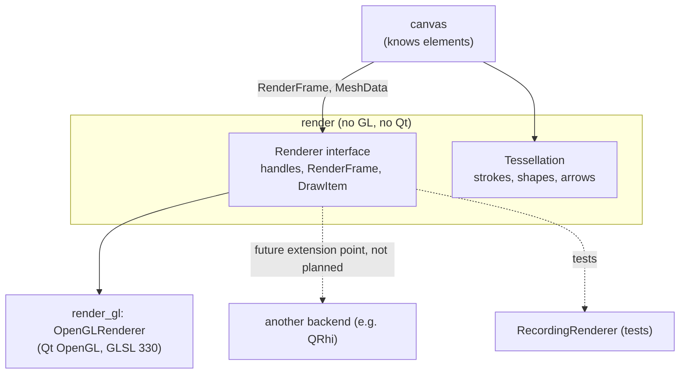

# Rendering Architecture

> Status: **Final baseline — not yet implemented.** Phase 1 creates the `studyapp_render`
> and `studyapp_render_gl` targets (module anchors; `render_gl` links Qt6::OpenGL). The
> OpenGL 3.3 core renderer is built in Phase 4. OpenGL 3.3 core is the only renderer target;
> QRhi, Vulkan, Metal and Direct3D are *not* planned work.

## 1. Goals and non-goals

**Goals**

* Smooth (60 fps+) pan/zoom and low-latency inking on pages with thousands of elements.
* OpenGL confined to one module (`render_gl`); the rest of the app is renderer-agnostic.
* The renderer could be replaced in the future without touching the document, canvas or
  persistence. Only the OpenGL backend is planned.
* CPU-side geometry generation that is deterministic and unit-testable.

**Non-goals (for now)**

* A general-purpose scene graph or 3D engine.
* GPU compute, bindless resources, or anything beyond OpenGL 3.3 core.
* Vector-exact export — export uses a separate QPainter path (§9).

## 2. Layering



The renderer draws **render primitives** (meshes, textured quads, overlays) — it does not
know what a stroke, page or database is. The canvas translates elements into primitives
and owns the caches that map one to the other.

## 3. Render API (`render`)

```cpp
namespace studyapp::render {

struct MeshHandle    { std::uint32_t index, generation; };   // opaque, cheap to copy
struct TextureHandle { std::uint32_t index, generation; };

struct Vertex { core::Vec2 pos; core::Vec2 aa; /* edge-distance for AA, later */ };

struct MeshData {                       // CPU mesh, element-local coordinates
    std::vector<Vertex> vertices;
    std::vector<std::uint32_t> indices;
    core::Rect bounds;
};

struct ImageData { core::Size size; PixelFormat format; std::span<const std::byte> pixels; };

enum class Material : std::uint8_t {
    SolidColor,         // strokes, shape fills/outlines
    Textured,           // images, rasterised text, PDF tiles
    PatternBackground,  // procedural ruled/grid/dots
    Highlighter,        // translucent, no self-overlap darkening
};

struct DrawItem {
    MeshHandle mesh;                    // or a unit quad for Textured
    TextureHandle texture;              // Textured only
    core::Affine2f transform;           // local → camera-relative world (float, see §5)
    core::Color color;                  // tint / solid colour (straight alpha)
    float opacity = 1.f;
    Material material = Material::SolidColor;
};

struct RenderFrame {
    core::Vec2 viewportPx;  float devicePixelRatio;
    double zoom;                        // world → view scale
    core::Color clearColor;
    BackgroundParams background;        // page rect, pattern, spacing (camera-relative)
    std::span<const DrawItem> content;  // painter's order, already culled
    std::span<const DrawItem> overlay;  // view-space items (selection, handles, lasso)
    ColorTransform colorTransform;      // e.g. dark-paper mode mapping (§8)
};

class Renderer {
public:
    virtual ~Renderer() = default;
    virtual Result<void> initialize() = 0;              // context is current
    virtual void resize(core::Vec2 viewportPx, float dpr) = 0;

    virtual MeshHandle    createMesh(const MeshData&) = 0;
    virtual void          updateMesh(MeshHandle, const MeshData&) = 0;  // e.g. live stroke
    virtual void          destroyMesh(MeshHandle) = 0;
    virtual TextureHandle createTexture(const ImageData&, TextureOptions) = 0;
    virtual void          destroyTexture(TextureHandle) = 0;

    virtual void render(const RenderFrame&) = 0;
    virtual RenderStats lastFrameStats() const = 0;     // draw calls, uploads, GPU ms
    virtual void releaseAll() = 0;                      // context about to be lost
};
}
```

Design choices:

* **Retained resources, immediate frames.** Meshes and textures persist across frames
  (uploaded once); each frame is a flat, ordered list of references. This maps cleanly to
  OpenGL today and to QRhi/Metal/Vulkan command recording later.
* **Generational handles**, not pointers — stale handles are detectable and nothing
  outside the backend holds GPU objects.
* **All calls on the thread that owns the context** (the GUI thread). Worker threads
  produce `MeshData`/`ImageData` only.

## 4. Tessellation (`render`, CPU)

Pure functions, no state, unit-tested with geometric assertions:

* `tessellateStroke(points, brush, baseWidth, lod) → MeshData`
  Variable-width polyline: per-point half-width from pressure; offset along smoothed
  normals; **round joins and caps** built from triangle fans (segment count chosen from
  the on-screen radius); miter-free to avoid spikes on sharp turns.
* `tessellateShape(Shape, lod)`: rectangles (rounded), ellipses (adaptive segments),
  polygons (ear clipping for fill), outlines via the polyline stroker, dashes by segment
  splitting.
* `tessellateArrowHead(cap, width)`.
* **LOD**: segment counts and point decimation depend on on-screen size. Meshes are
  rebuilt only when the zoom crosses an LOD bucket boundary (e.g. factors of 2), not on
  every zoom step.

Because stroke meshes are in element-local space, moving/rotating/scaling only changes
the per-draw transform.

## 5. Coordinate handling and precision

The canvas computes each item's transform in double precision **relative to the camera
centre**, then converts to float:

```
itemTransform = translate(element.position − camera.center) ∘ rotate ∘ scale   (double → float)
vertex shader:  clip = projection(viewport, zoom) * itemTransform * localPos
```

Float precision therefore only needs to cover "element size" and "screen size", never
"distance from the world origin". The projection uniform folds in zoom and viewport.

## 6. OpenGL backend (`render_gl`)

### 6.1 Context and integration

* `ui::CanvasWidget : QOpenGLWidget`; `QSurfaceFormat` requests **OpenGL 3.3 core
  profile**, 8-bit RGBA, stencil 8, 4× MSAA (configurable), and a debug context in debug
  builds.
* Function loading via `QOpenGLFunctions_3_3_Core` (obtained from the context) —
  no separate loader library.
* `CanvasWidget::initializeGL/resizeGL/paintGL` delegate to `OpenGLRenderer`;
  `QOpenGLContext::aboutToBeDestroyed` → `releaseAll()`. The canvas re-uploads from its
  CPU caches if the context is recreated (e.g. widget re-parented to another window).
* Only files under `src/render_gl/` include GL headers; `tools/check_boundaries.py`
  (CTest + CI) enforces it.

### 6.2 Shaders

GLSL `#version 330 core`, stored in `resources/shaders/*.vert|*.frag`, compiled into the
binary through Qt's resource system (`qt_add_resources` on the `render_gl` target), and
compiled/linked at `initialize()` with errors surfaced through `Result`.

| Program | Used for |
|---|---|
| `solid` | strokes, shape fills/outlines, arrowheads |
| `textured` | images, text rasters, PDF tiles (premultiplied alpha) |
| `pattern` | procedural page background: ruled/grid/dots computed in the fragment shader — no geometry per line, crisp at any zoom |
| `overlay` | view-space selection rectangles, handles, lasso (dashed via shader) |

Uniforms: a small per-frame uniform block (projection, colour transform) and per-draw
uniforms (transform, colour, opacity). UBOs are core in 3.3.

### 6.3 Buffers and batching

Phase 4 (simple and correct first):

* One VAO/VBO/IBO per mesh; one draw call per visible item; state sorted only where it
  does not violate painter's order.

Phase 9 (driven by profiling, same public API):

* **Buffer arena**: meshes sub-allocated from a few large VBOs/IBOs, so batching needs no
  buffer rebinds.
* **Consecutive-item batching**: runs of adjacent items with the same material/texture are
  merged into one draw using per-instance transform/colour data (instanced attributes).
  Only *adjacent* items are merged, so overlap order stays correct.
* **Static chunks**: for untouched regions, strokes may be merged into pre-transformed
  chunk meshes invalidated on edit.

### 6.4 Textures

* RGBA8 with mipmaps for images; `GL_LINEAR_MIPMAP_LINEAR` + anisotropic filtering when
  available (optional extension, never required).
* Images larger than `GL_MAX_TEXTURE_SIZE` are split into tiles.
* A texture memory budget (default 512 MB, tuned per GPU) with LRU eviction of text
  rasters and PDF tiles; evicted content re-rasterises on demand.
* Uploads are rate-limited per frame (time budget, e.g. 4 ms) so opening a page with
  many images degrades progressively instead of stalling.

### 6.5 Blending and anti-aliasing

* Premultiplied alpha throughout the textured path; straight colours converted in shaders.
* Anti-aliasing: MSAA first (simple, handles all geometry). Analytic edge AA (a
  distance-to-edge vertex attribute, the `aa` field reserved in `Vertex`) is the planned
  upgrade if MSAA cost or quality on thin strokes is insufficient.
* **Highlighter / translucent strokes**: tessellated strokes overlap themselves at joins,
  which darkens translucent ink. Each translucent stroke is drawn with a stencil test
  ("write once per stroke": increment on first write, reject further writes, clear per
  stroke or use alternating stencil values). Opaque strokes don't need it.

### 6.6 Frame loop

* **Render on demand**: `update()` is requested only when something changed (input,
  camera, patch, async result). No continuous render loop; idle CPU/GPU usage is zero.
* VSync on; the widget coalesces multiple update requests into one paint.
* Frame passes: clear → background (pattern or page rect) → document backgrounds (PDF
  tiles) → content items in order → live stroke/preview → overlays (view space).

### 6.7 Errors and fallbacks

* If a 3.3 core context cannot be created: show a clear message, and on Windows offer the
  software rasteriser (`opengl32sw.dll`, deployed with the app; `QT_OPENGL=software`).
* Debug builds attach `QOpenGLDebugLogger` (KHR_debug when available) and label GL
  objects for RenderDoc captures.

## 7. Culling

Culling happens in `canvas` (spatial grid query against the camera's visible world rect,
inflated by a small margin), so the renderer only receives visible items. Off-screen
GPU resources stay resident until memory pressure evicts them (LRU).

## 8. Theming the canvas

* UI themes (light/dark) come from Qt palettes/QSS. The canvas has its own render
  settings: background colour, pattern colour, selection colour.
* **Dark paper mode** is a *display* transform (`ColorTransform` in the frame, applied in
  shaders), e.g. inverting luminance while preserving hue so black ink becomes light on a
  dark page. The stored document is never modified; export always uses true colours.

## 9. Export and printing (not the GL path)

PDF/PNG/SVG export and printing are implemented by `platform::QtPageExporter` using
`QPainter` directly on document elements (paths from stroke outlines, real text, embedded
images, PDF page backgrounds). This yields vector output, which a GPU mesh path cannot.
The export code reuses the `render` tessellation's outline generation so on-screen and
exported ink match.

## 10. Profiling plan

| Measurement | Mechanism |
|---|---|
| CPU frame time, build-frame time, culling time | Scoped timer macro (`SA_PROFILE_SCOPE`) → debug HUD; optional Tracy integration |
| GPU frame time | `GL_TIME_ELAPSED` queries (core since 3.3), double-buffered to avoid stalls |
| Draw calls, triangles, bytes uploaded, texture memory | `RenderStats` per frame |
| Tessellation throughput | Google Benchmark in `bench/` (strokes/s, points/s) |
| Input latency | Timestamp from event → presented frame, logged in debug HUD |

The debug HUD (toggle with a shortcut in debug builds) shows these live. Performance
work is only merged with before/after numbers from these tools.

## 11. Future extension point: other backends (not scheduled)

Nothing in this section is planned work; it records why the API is shaped the way it is.
`QRhi` (public since Qt 6.6, `QRhiWidget` since 6.7) gives one API over Metal, D3D11/12,
Vulkan and OpenGL, and would be the most likely second backend if one is ever needed —
especially for macOS, where OpenGL is deprecated. The `render` API avoids GL-specific concepts (no GL enums, no
binding points, no global state) so a `render_rhi` target could implement it with:

* `MeshHandle` → `QRhiBuffer` sub-allocation;
* `TextureHandle` → `QRhiTexture`;
* materials → pre-built `QRhiGraphicsPipeline`s (shaders via `qsb`);
* `render(frame)` → one `QRhiCommandBuffer` pass.

Switching would change `ui::CanvasWidget` (from `QOpenGLWidget` to `QRhiWidget`) and the
backend target — nothing in `canvas`, `document` or `persistence`.
